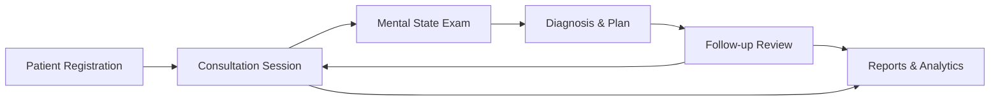

# System Overview

## Purpose

The Mental Health Consultation Web App is a specialized clinical documentation platform designed to streamline mental health consultation workflows for healthcare professionals. The system provides structured tools for patient management, clinical assessment, diagnosis documentation, and progress tracking while maintaining rigorous security and compliance standards for protected health information (PHI).

## Scope

This MVP (Minimum Viable Product) focuses on **core clinical documentation and consultation management** for mental health providers. The platform is designed exclusively for **clinician use** and does not include patient-facing features.

### Primary Objectives

1. **Streamline Clinical Workflows**: Reduce administrative burden with structured forms and efficient data entry
2. **Standardize Documentation**: Ensure consistent, comprehensive mental health assessments using structured Mental State Examinations
3. **Enable Care Continuity**: Track patient progress across multiple consultations and clinicians
4. **Support Clinical Decisions**: Provide accessible patient history, diagnoses, and treatment plans
5. **Ensure Compliance**: Maintain HIPAA/GDPR-ready security with comprehensive audit trails

## Target Users

### Primary Users: Healthcare Clinicians

The application is designed for licensed mental health professionals conducting clinical consultations:

- **Psychiatrists**: Medical doctors specializing in mental health treatment
- **Psychologists**: Doctoral-level providers offering psychological assessment and therapy
- **Licensed Clinical Social Workers (LCSW)**: Masters-level therapists providing clinical services
- **Mental Health Counselors**: Licensed counselors (LPC, LMHC) providing therapeutic interventions
- **Psychiatric Nurse Practitioners**: Advanced practice nurses specializing in mental health

**Typical User Activities**:
- Registering new patients
- Documenting consultation sessions
- Conducting Mental State Examinations
- Recording diagnoses and treatment plans
- Reviewing patient progress
- Generating clinical reports

### Administrative Users

- **Clinical Administrators**: Manage user accounts, configure system settings, review audit logs
- **System Administrators**: Technical staff managing deployment, backups, and system maintenance

> [!IMPORTANT]
> **Clinician-Only Access**: This application is NOT designed for patient self-service. All system access requires healthcare credentials and appropriate role assignment.

## Key Capabilities

### 1. Client/Patient Management
- Complete demographic information capture
- Emergency contact and next-of-kin tracking
- Patient search and record retrieval
- Historical consultation access

### 2. Consultation Documentation
- Structured consultation note templates
- Multi-clinician collaboration on shared cases
- Comprehensive assessment forms
- Session date/time tracking
- Chief complaint and presenting problem documentation

### 3. Mental State Examination (MSE)
- Standardized assessment framework
- Structured dropdown selections for:
  - Appearance and behavior
  - Speech and language
  - Mood and affect
  - Thought content and process
  - Perception (hallucinations, illusions)
  - Cognition and sensorium
  - Insight and judgment
- Free-text clinical observations

### 4. Diagnosis & Management Planning
- Diagnostic impression recording (primary diagnosis)
- Differential diagnoses tracking
- Treatment plan documentation
- Follow-up scheduling
- Clinical recommendations

### 5. Consultation Review & Progress Notes
- Follow-up visit documentation
- Vitals recording (blood pressure, heart rate, weight, etc.)
- Progress assessment
- Treatment response evaluation
- Plan modifications

### 6. Reports & Analytics
- **Tabular Reports**:
  - Patient lists with demographic filters
  - Consultation logs by clinician/date range
  - Diagnosis summaries and statistics
- **Dashboards**:
  - Consultation volume trends
  - Diagnosis distribution
  - Follow-up adherence rates
- **Export Capabilities**: CSV (raw data), PDF (formatted reports)

### 7. System-Level Features
- **Authentication**: Secure login with password policies
- **Role-Based Access Control**: Admin vs. clinician permissions
- **Audit Logging**: Comprehensive activity tracking for compliance
- **Data Encryption**: Protected storage for PHI

## Technology Context

### Deployment Model
- **Web-Based Application**: Accessible via modern web browsers (Chrome, Firefox, Safari, Edge)
- **Responsive Design**: Optimized for desktop and tablet use
- **Cloud or On-Premise**: Flexible deployment options

### Security Requirements
- **Encryption at Rest**: Database-level encryption for stored PHI
- **Encryption in Transit**: TLS/SSL for all network communications
- **Session Management**: Automatic timeout, secure session tokens
- **Audit Trails**: Immutable logs of all data access and modifications

### Data Storage
- **Relational Database**: Structured data with referential integrity
- **Backup Strategy**: Regular automated backups with disaster recovery
- **Data Retention**: Configurable retention policies per regulatory requirements

## Clinical Workflow Overview

### Typical Session Flow

1. **Patient Check-In**: Clinician selects existing patient or registers new patient
2. **Consultation Creation**: Initiates new consultation session with date/time
3. **Clinical Assessment**:
   - Chief complaint documentation
   - History of present illness
   - Mental State Examination (structured)
4. **Diagnosis**: Records diagnostic impressions and differential diagnoses
5. **Treatment Planning**: Documents management plan and next steps
6. **Follow-Up**: Schedules next appointment, creates review entry
7. **Reporting**: Generates reports for clinical review or administrative purposes

## System Benefits

### For Clinicians
✅ **Reduced Documentation Time**: Structured forms with dropdowns minimize typing  
✅ **Consistent Quality**: Standardized MSE ensures comprehensive assessments  
✅ **Easy Access to History**: Quick retrieval of patient records and past consultations  
✅ **Multi-Clinician Collaboration**: Shared access to consultation notes  

### For Organizations
✅ **Regulatory Compliance**: HIPAA/GDPR-ready security and audit capabilities  
✅ **Data-Driven Insights**: Analytics support quality improvement initiatives  
✅ **Scalable Platform**: Supports multiple clinicians and locations  
✅ **Audit Readiness**: Comprehensive logs for compliance reviews  

### For Patients (Indirect Benefits)
✅ **Continuity of Care**: Complete records accessible to treating clinicians  
✅ **Standardized Care**: Evidence-based assessment frameworks  
✅ **Care Coordination**: Multi-clinician collaboration on complex cases  

## MVP Limitations

> [!WARNING]
> **MVP Scope Constraints**: This initial version does NOT include:
> - Billing and insurance claims processing
> - Medication management or e-prescribing
> - Patient portal or self-service features
> - Telemedicine/video consultation capabilities
> - Integration with external EHR systems

See [MVP Boundaries](08-mvp-boundaries.md) for complete scope details.

## Compliance Readiness

### HIPAA (United States)
- **Privacy Rule**: Role-based access controls limit PHI exposure
- **Security Rule**: Encryption, audit logs, access controls implemented
- **Breach Notification**: Audit logs support breach detection and reporting

### GDPR (European Union)
- **Lawful Processing**: Consent management and purpose limitation
- **Data Subject Rights**: Support for access, rectification, erasure requests
- **Data Protection by Design**: Encryption and pseudonymization capabilities

> [!CAUTION]
> **Compliance Responsibility**: While the platform provides technical controls for HIPAA/GDPR compliance, organizations must implement appropriate policies, procedures, and business associate agreements to achieve full regulatory compliance.

## Future Enhancements (Post-MVP)

Potential features for future releases:
- **E-Prescribing**: Medication management and prescription transmission
- **Patient Portal**: Secure patient access to appointments and educational materials
- **Telemedicine**: Video consultation integration
- **Advanced Analytics**: Predictive modeling, outcome tracking, quality metrics
- **EHR Integration**: HL7/FHIR interfaces with electronic health record systems
- **Mobile Applications**: Native iOS/Android apps for clinicians

## Success Metrics

The MVP will be considered successful when it demonstrates:

1. **Adoption**: 80%+ of clinicians use the system for daily consultations
2. **Documentation Quality**: 95%+ of consultations have complete MSE entries
3. **Efficiency**: 30%+ reduction in time spent on clinical documentation
4. **Compliance**: Zero audit findings related to access controls or logging
5. **Satisfaction**: Net Promoter Score (NPS) of 40+ from clinician users

---

**Next Steps**: Review [Feature Breakdown](02-feature-breakdown.md) for detailed module specifications.
