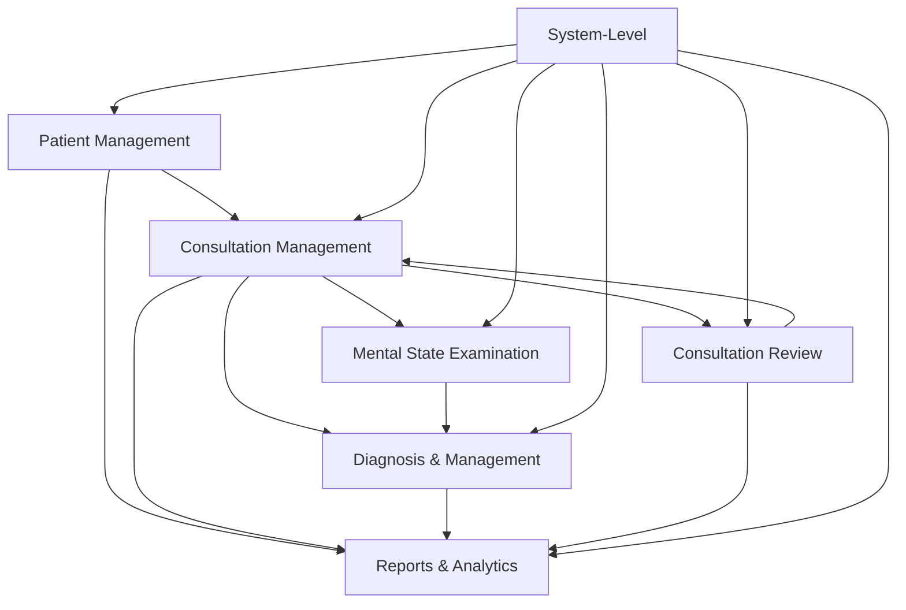

# Feature Breakdown

This document provides detailed specifications for all 7 core modules of the Mental Health Consultation Web App MVP.

---

## Module 1: Client/Patient Management

### Overview
Comprehensive patient registry enabling clinicians to create, view, update, and manage patient demographic information, emergency contacts, and next-of-kin details.

### CRUD Operations

| Operation | Description | Access Level |
|-----------|-------------|--------------|
| **Create** | Register new patient with demographics and contacts | Clinician, Admin |
| **Read** | View patient details, search patient records | Clinician, Admin |
| **Update** | Modify patient information, update contact details | Clinician, Admin |
| **Delete** | Soft delete (archive) patient records | Admin only |

### Form Fields

#### Patient Demographics

| Field Name | Type | Required | Validation/Options | Notes |
|------------|------|----------|-------------------|-------|
| Patient ID | Auto-generated | Yes | Unique identifier | System-generated |
| First Name | Text | Yes | Max 50 characters | |
| Middle Name | Text | No | Max 50 characters | |
| Last Name | Text | Yes | Max 50 characters | |
| Date of Birth | Date | Yes | Valid date, age 0-120 | Calculate age automatically |
| Gender | Dropdown | Yes | Male, Female, Non-binary, Prefer not to say, Other | |
| Phone Number | Text | Yes | Valid phone format | Primary contact |
| Email Address | Text | No | Valid email format | Optional contact |
| Address Line 1 | Text | Yes | Max 100 characters | Street address |
| Address Line 2 | Text | No | Max 100 characters | Apt/Suite |
| City | Text | Yes | Max 50 characters | |
| State/Province | Dropdown | Yes | Standard state/province codes | |
| Postal Code | Text | Yes | Valid postal format | |
| Country | Dropdown | Yes | ISO country codes | Default to organization country |
| Marital Status | Dropdown | No | Single, Married, Divorced, Widowed, Separated | |
| Occupation | Text | No | Max 100 characters | |
| Education Level | Dropdown | No | None, Primary, Secondary, Undergraduate, Graduate, Doctoral | |

#### Emergency Contact / Next of Kin

| Field Name | Type | Required | Validation/Options | Notes |
|------------|------|----------|-------------------|-------|
| Contact Name | Text | Yes | Max 100 characters | Full name |
| Relationship | Dropdown | Yes | Spouse, Parent, Child, Sibling, Friend, Other | |
| Phone Number | Text | Yes | Valid phone format | Primary contact |
| Alternate Phone | Text | No | Valid phone format | |
| Email | Text | No | Valid email format | |
| Address | Text | No | Max 200 characters | Optional full address |
| Is Primary Contact | Checkbox | No | Boolean | Mark as primary emergency contact |

### Business Rules

1. **Unique Patient Identification**: System prevents duplicate patients based on (First Name + Last Name + DOB)
2. **At Least One Contact**: Patient record requires at least one emergency contact
3. **Age Validation**: DOB must result in valid age (0-120 years)
4. **Phone Validation**: At least one phone number (patient or emergency contact) must be provided
5. **Soft Delete Only**: Patient records are archived, not permanently deleted, to maintain consultation history
6. **Audit Logging**: All patient record modifications are logged with user and timestamp

### User Interface Features

- **Advanced Search**: Search by name, patient ID, phone, DOB
- **Filters**: Active vs. archived patients, age range, last consultation date
- **Patient List View**: Sortable table with key demographics
- **Patient Detail View**: Full profile with tabs for demographics, contacts, and consultation history

---

## Module 2: Consultation Management

### Overview
Core clinical documentation module for creating and managing consultation sessions, including single-clinician and multi-clinician notes.

### CRUD Operations

| Operation | Description | Access Level |
|-----------|-------------|--------------|
| **Create** | Initiate new consultation session for a patient | Clinician, Admin |
| **Read** | View consultation notes and history | Clinician (own + shared), Admin |
| **Update** | Edit consultation notes and assessments | Clinician (owner + collaborators), Admin |
| **Delete** | Soft delete consultation record | Admin only |

### Form Fields

#### Consultation Header

| Field Name | Type | Required | Validation/Options | Notes |
|------------|------|----------|-------------------|-------|
| Consultation ID | Auto-generated | Yes | Unique identifier | System-generated |
| Patient | Dropdown/Search | Yes | Active patients only | Link to patient record |
| Consultation Date | Date | Yes | Valid date, not future | Default to today |
| Consultation Time | Time | Yes | Valid time format | |
| Primary Clinician | Auto-filled | Yes | Current logged-in user | |
| Collaborating Clinicians | Multi-select | No | Active clinicians | For multi-clinician consultations |
| Session Type | Dropdown | Yes | Initial Assessment, Follow-up, Crisis Intervention, Therapy Session, Medication Review | |
| Session Duration | Number | No | Minutes (1-480) | Optional time tracking |

#### Clinical Documentation

| Field Name | Type | Required | Validation/Options | Notes |
|------------|------|----------|-------------------|-------|
| Chief Complaint | Text Area | Yes | Max 500 characters | Patient's stated reason for visit |
| History of Present Illness | Rich Text | Yes | Max 5000 characters | Detailed narrative |
| Past Psychiatric History | Rich Text | No | Max 3000 characters | Prior diagnoses, treatments, hospitalizations |
| Medical History | Rich Text | No | Max 2000 characters | Relevant medical conditions |
| Family History | Rich Text | No | Max 2000 characters | Family psychiatric/medical history |
| Social History | Rich Text | No | Max 2000 characters | Living situation, support system, substance use |
| Current Medications | Text Area | No | Max 1500 characters | List of current medications (MVP: free text) |
| Allergies | Text Area | No | Max 500 characters | Drug and other allergies |

#### Assessment Form Integration

| Field Name | Type | Required | Validation/Options | Notes |
|------------|------|----------|-------------------|-------|
| MSE Completed | Checkbox | No | Boolean | Link to MSE module (see Module 3) |
| Diagnosis Documented | Checkbox | No | Boolean | Link to Diagnosis module (see Module 4) |
| Risk Assessment | Dropdown | Yes | Low, Moderate, High | Suicide/violence risk |
| Safety Plan Required | Checkbox | No | Boolean | Triggers safety planning documentation |

#### Clinical Impressions & Plan

| Field Name | Type | Required | Validation/Options | Notes |
|------------|------|----------|-------------------|-------|
| Clinical Summary | Rich Text | Yes | Max 3000 characters | Synthesis of findings |
| Treatment Interventions | Text Area | No | Max 2000 characters | Interventions provided this session |
| Clinical Notes | Rich Text | No | Max 5000 characters | Free-form session notes |

### Multi-Clinician Collaboration

| Feature | Description |
|---------|-------------|
| **Collaborator Selection** | Primary clinician can add other clinicians as collaborators |
| **Shared Edit Access** | All collaborators can view and edit consultation notes |
| **Contribution Tracking** | System logs which clinician made each edit |
| **Notification** | Collaborators notified when added to consultation |
| **Permission Model** | Collaborators have same access as primary clinician for that consultation |

### Business Rules

1. **One Consultation Per Patient Per Day**: System warns if creating multiple consultations for same patient on same date
2. **Consultation Lock**: After 30 days, consultations become read-only (configurable)
3. **Chief Complaint Required**: Cannot save consultation without chief complaint
4. **Risk Assessment Mandatory**: All consultations require risk level documentation
5. **Auto-Save**: System auto-saves every 2 minutes to prevent data loss
6. **Edit History**: All changes tracked with user and timestamp for audit compliance

### User Interface Features

- **Quick Patient Selection**: Type-ahead search for patient
- **Template Library**: Pre-defined templates for common consultation types
- **Copy Forward**: Option to copy previous consultation notes as starting point
- **Print/Export**: Generate PDF consultation summary
- **Timeline View**: See all consultations for a patient in chronological order

---

## Module 3: Mental State Examination (MSE)

### Overview
Structured clinical assessment tool providing standardized evaluation of a patient's mental status through systematic observation and questioning.

### CRUD Operations

| Operation | Description | Access Level |
|-----------|-------------|--------------|
| **Create** | Complete MSE assessment for a consultation | Clinician, Admin |
| **Read** | View completed MSE assessments | Clinician (own + collaborative), Admin |
| **Update** | Modify MSE findings | Clinician (owner + collaborators), Admin |
| **Delete** | Remove MSE entry (linked to consultation deletion) | Admin only |

### MSE Assessment Categories

#### 1. Appearance & Behavior

| Field Name | Type | Required | Options | Notes |
|------------|------|----------|---------|-------|
| General Appearance | Dropdown | Yes | Well-groomed, Disheveled, Bizarre, Age-appropriate, Inappropriately dressed | |
| Level of Consciousness | Dropdown | Yes | Alert, Drowsy, Lethargic, Stuporous, Comatose | |
| Eye Contact | Dropdown | Yes | Appropriate, Avoidant, Intense/Staring, Fleeting | |
| Psychomotor Activity | Dropdown | Yes | Normal, Agitated, Restless, Retarded, Hyperactive, Catatonic | |
| Attitude Toward Examiner | Dropdown | Yes | Cooperative, Guarded, Hostile, Suspicious, Evasive, Seductive | |
| Behavior Notes | Text Area | No | Max 500 characters | Additional observations |

#### 2. Speech & Language

| Field Name | Type | Required | Options | Notes |
|------------|------|----------|---------|-------|
| Rate | Dropdown | Yes | Normal, Rapid, Slow, Pressured | |
| Volume | Dropdown | Yes | Normal, Loud, Soft, Whispered | |
| Tone | Dropdown | Yes | Normal, Monotone, Dramatic, Flat | |
| Fluency | Dropdown | Yes | Fluent, Non-fluent, Hesitant, Stuttering | |
| Articulation | Dropdown | Yes | Clear, Slurred, Mumbled | |
| Speech Notes | Text Area | No | Max 500 characters | Language abnormalities, neologisms |

#### 3. Mood & Affect

| Field Name | Type | Required | Options | Notes |
|------------|------|----------|---------|-------|
| Reported Mood | Text | Yes | Max 100 characters | Patient's stated mood in own words |
| Observed Affect | Dropdown | Yes | Euthymic, Depressed, Anxious, Irritable, Euphoric, Angry, Labile | |
| Affect Range | Dropdown | Yes | Full, Restricted, Blunted, Flat | |
| Affect Congruence | Dropdown | Yes | Congruent with mood, Incongruent | |
| Mood Notes | Text Area | No | Max 500 characters | |

#### 4. Thought Process & Content

| Field Name | Type | Required | Options | Notes |
|------------|------|----------|---------|-------|
| **Thought Process** | | | | |
| Organization | Dropdown | Yes | Logical, Goal-directed, Circumstantial, Tangential, Loose associations, Flight of ideas, Thought blocking | |
| Coherence | Dropdown | Yes | Coherent, Incoherent, Disorganized | |
| **Thought Content** | | | | |
| Delusions | Multi-select | No | None, Persecutory, Grandiose, Somatic, Referential, Erotomanic, Nihilistic | |
| Delusion Details | Text Area | No | Max 500 characters | Description if present |
| Obsessions | Checkbox | No | Boolean | Intrusive thoughts |
| Compulsions | Checkbox | No | Boolean | Repetitive behaviors |
| Phobias | Text | No | Max 200 characters | Specific fears if present |
| Suicidal Ideation | Dropdown | Yes | None, Passive, Active without plan, Active with plan, Active with intent | |
| Homicidal Ideation | Dropdown | Yes | None, Passive, Active without plan, Active with plan, Active with intent | |
| Thought Notes | Text Area | No | Max 1000 characters | Additional details |

#### 5. Perception

| Field Name | Type | Required | Options | Notes |
|------------|------|----------|---------|-------|
| Hallucinations | Multi-select | No | None, Auditory, Visual, Tactile, Olfactory, Gustatory | |
| Hallucination Details | Text Area | No | Max 500 characters | Description, content, command type |
| Illusions | Checkbox | No | Boolean | Misinterpretations |
| Depersonalization | Checkbox | No | Boolean | Feeling detached from self |
| Derealization | Checkbox | No | Boolean | Feeling surroundings are unreal |
| Perception Notes | Text Area | No | Max 500 characters | |

#### 6. Cognition & Sensorium

| Field Name | Type | Required | Options | Notes |
|------------|------|----------|---------|-------|
| Orientation - Person | Dropdown | Yes | Oriented, Disoriented | Knows own name |
| Orientation - Place | Dropdown | Yes | Oriented, Disoriented | Knows location |
| Orientation - Time | Dropdown | Yes | Oriented, Disoriented | Knows date/time |
| Orientation - Situation | Dropdown | Yes | Oriented, Disoriented | Understands context |
| Attention/Concentration | Dropdown | Yes | Intact, Impaired, Grossly impaired | Ability to focus |
| Memory - Immediate | Dropdown | Yes | Intact, Impaired, Grossly impaired | Registration |
| Memory - Recent | Dropdown | Yes | Intact, Impaired, Grossly impaired | Hours to days |
| Memory - Remote | Dropdown | Yes | Intact, Impaired, Grossly impaired | Months to years |
| Fund of Knowledge | Dropdown | No | Average, Above average, Below average | General knowledge |
| Abstraction | Dropdown | No | Intact, Concrete, Impaired | Proverb interpretation |
| Cognition Notes | Text Area | No | Max 500 characters | |

#### 7. Insight & Judgment

| Field Name | Type | Required | Options | Notes |
|------------|------|----------|---------|-------|
| Insight | Dropdown | Yes | Good, Fair, Poor, Absent | Awareness of illness |
| Insight Description | Text Area | No | Max 300 characters | Elaboration |
| Judgment | Dropdown | Yes | Good, Fair, Poor, Grossly impaired | Decision-making capacity |
| Judgment Description | Text Area | No | Max 300 characters | Examples |

### Business Rules

1. **Linked to Consultation**: MSE must be associated with a valid consultation
2. **Required Fields**: Minimum required fields must be completed to save MSE
3. **Risk Documentation**: If suicidal/homicidal ideation is anything other than "None", requires additional safety documentation
4. **Edit Restrictions**: Only primary clinician and collaborators can edit MSE
5. **Audit Trail**: All MSE entries logged with clinician, date, and timestamp

### User Interface Features

- **Section Tabs**: Organize MSE into logical sections for easier navigation
- **Quick Complete**: Option to mark entire category as "Within Normal Limits"
- **Previous MSE Comparison**: View side-by-side comparison with previous MSE for same patient
- **Print MSE**: Generate formatted MSE summary for medical records
- **Templates**: Save common MSE patterns as templates

---

## Module 4: Diagnosis & Management

### Overview
Clinical decision support module for documenting diagnostic impressions, differential diagnoses, treatment plans, and follow-up care.

### CRUD Operations

| Operation | Description | Access Level |
|-----------|-------------|--------------|
| **Create** | Record diagnosis and management plan | Clinician, Admin |
| **Read** | View diagnostic history and treatment plans | Clinician (own + collaborative), Admin |
| **Update** | Modify diagnoses and management plans | Clinician (owner + collaborators), Admin |
| **Delete** | Remove diagnosis entry (linked to consultation) | Admin only |

### Form Fields

#### Diagnostic Impressions

| Field Name | Type | Required | Validation/Options | Notes |
|------------|------|----------|-------------------|-------|
| Primary Diagnosis | Text/Search | Yes | ICD-10 code + description | Type-ahead search for ICD-10 codes |
| Diagnosis Code | Auto-filled | Yes | Valid ICD-10 code | From diagnosis selection |
| Diagnosis Status | Dropdown | Yes | Provisional, Confirmed, Rule-out | |
| Severity | Dropdown | No | Mild, Moderate, Severe | If applicable |
| Onset Date | Date | No | Valid past date | When symptoms began |

#### Differential Diagnoses (Multiple)

| Field Name | Type | Required | Validation/Options | Notes |
|------------|------|----------|---------|-------|
| Differential Diagnosis | Text/Search | No | ICD-10 code + description | Alternative diagnoses being considered |
| Diagnosis Code | Auto-filled | No | Valid ICD-10 code | |
| Rationale | Text Area | No | Max 300 characters | Why considered |
| Likelihood | Dropdown | No | High, Moderate, Low | Clinical judgment |

#### Management Plan

| Field Name | Type | Required | Validation/Options | Notes |
|------------|------|----------|-------------------|-------|
| Treatment Modality | Multi-select | Yes | Psychotherapy, Medication Management, Case Management, Crisis Intervention, Group Therapy, Family Therapy, Other | |
| Psychotherapy Type | Dropdown | No | CBT, DBT, Psychodynamic, Supportive, Motivational Interviewing, Other | If psychotherapy selected |
| Therapy Frequency | Dropdown | No | Weekly, Bi-weekly, Monthly, As needed | |
| Treatment Goals | Rich Text | Yes | Max 2000 characters | Measurable treatment objectives |
| Clinical Recommendations | Rich Text | Yes | Max 2000 characters | Specific interventions and actions |
| Patient Education Provided | Text Area | No | Max 1000 characters | Topics discussed with patient |
| Referrals | Text Area | No | Max 500 characters | External referrals (specialists, services) |

#### Follow-Up Planning

| Field Name | Type | Required | Validation/Options | Notes |
|------------|------|----------|-------------------|-------|
| Next Visit Date | Date | No | Future date | Scheduled follow-up |
| Next Visit Purpose | Dropdown | No | Medication Review, Therapy Session, Progress Check, Crisis Follow-up, Discharge Planning | |
| Follow-Up Interval | Dropdown | No | 1 week, 2 weeks, 1 month, 3 months, 6 months, As needed | |
| Urgent Follow-Up Required | Checkbox | No | Boolean | Flag for expedited scheduling |
| Follow-Up Notes | Text Area | No | Max 500 characters | Special instructions |

### Business Rules

1. **Diagnosis Required**: Consultation cannot be finalized without at least one primary diagnosis
2. **ICD-10 Validation**: All diagnoses must map to valid ICD-10 codes
3. **Management Plan Mandatory**: Treatment goals and recommendations required for all diagnoses
4. **Risk-Based Follow-Up**: High-risk patients (per risk assessment) require follow-up date within 2 weeks
5. **Multiple Diagnoses**: Support up to 10 differential diagnoses per consultation
6. **Diagnosis History**: Track all diagnoses over time for patient

### User Interface Features

- **ICD-10 Search**: Type-ahead search with code and description
- **Common Diagnoses**: Quick-select from frequently used diagnoses
- **Treatment Templates**: Pre-defined management plans for common diagnoses
- **Previous Diagnoses**: View historical diagnoses for patient
- **Diagnosis Timeline**: Visual timeline of diagnosis changes

---

## Module 5: Consultation Review

### Overview
Progress tracking module for follow-up visits, linking to previous consultations and documenting treatment response, vitals, and ongoing care.

### CRUD Operations

| Operation | Description | Access Level |
|-----------|-------------|--------------|
| **Create** | Document follow-up consultation review | Clinician, Admin |
| **Read** | View consultation reviews and progress | Clinician (own + collaborative), Admin |
| **Update** | Edit review notes and vitals | Clinician (owner + collaborators), Admin |
| **Delete** | Remove review entry | Admin only |

### Form Fields

#### Review Header

| Field Name | Type | Required | Validation/Options | Notes |
|------------|------|----------|-------------------|-------|
| Review ID | Auto-generated | Yes | Unique identifier | System-generated |
| Patient | Auto-filled | Yes | From linked consultation | |
| Review Date | Date | Yes | Valid date, not future | Default today |
| Linked Consultation | Dropdown | Yes | Previous consultations for patient | Which consultation is being reviewed |
| Reviewing Clinician | Auto-filled | Yes | Current user | |
| Visit Type | Dropdown | Yes | Scheduled Follow-up, Unscheduled, Crisis Visit, Medication Check | |

#### Vitals & Physical Measurements

| Field Name | Type | Required | Validation/Options | Notes |
|------------|------|----------|---------|-------|
| Blood Pressure (Systolic) | Number | No | 50-250 mmHg | |
| Blood Pressure (Diastolic) | Number | No | 30-150 mmHg | |
| Heart Rate | Number | No | 30-200 bpm | |
| Respiratory Rate | Number | No | 8-40 breaths/min | |
| Temperature | Number | No | 95-106°F or 35-41°C | Configurable units |
| Weight | Number | No | 50-500 lbs or 20-250 kg | Configurable units |
| Height | Number | No | 48-96 inches or 120-240 cm | Usually static after first entry |
| BMI | Auto-calculated | No | From weight/height | |
| Vitals Notes | Text Area | No | Max 300 characters | Any abnormalities |

#### Progress Assessment

| Field Name | Type | Required | Validation/Options | Notes |
|------------|------|----------|---------|-------|
| Subjective (Patient Report) | Rich Text | Yes | Max 2000 characters | Patient's report of symptoms/progress |
| Objective (Clinical Observation) | Rich Text | Yes | Max 2000 characters | Clinician's observations |
| Treatment Response | Dropdown | Yes | Significant Improvement, Moderate Improvement, Minimal Improvement, No Change, Worsening | |
| Medication Adherence | Dropdown | No | Fully Adherent, Mostly Adherent, Partially Adherent, Non-adherent, N/A | If applicable |
| Therapy Engagement | Dropdown | No | Excellent, Good, Fair, Poor, N/A | If applicable |
| Side Effects Reported | Text Area | No | Max 500 characters | Medication side effects |
| New/Worsening Symptoms | Text Area | No | Max 1000 characters | Symptom changes since last visit |

#### Assessment & Plan Updates

| Field Name | Type | Required | Validation/Options | Notes |
|------------|------|----------|----------|-------|
| Clinical Assessment | Rich Text | Yes | Max 2000 characters | Updated formulation |
| Plan Changes | Text Area | No | Max 1500 characters | Modifications to treatment plan |
| Continue Current Treatment | Checkbox | No | Boolean | No changes to plan |
| Goals Progress | Rich Text | No | Max 1500 characters | Progress toward treatment goals |
| New Interventions | Text Area | No | Max 1000 characters | Additional treatments initiated |
| Next Steps | Rich Text | Yes | Max 1000 characters | Plan until next visit |

### Business Rules

1. **Linked Consultation Required**: Review must link to an existing consultation
2. **Progress Note Mandatory**: Subjective and objective sections required
3. **Treatment Response**: Required for all follow-up visits
4. **Vital Trends**: System automatically calculates trends if multiple vitals recorded
5. **Overdue Follow-Up Alert**: Flags if review is overdue based on previous follow-up date
6. **Auto-Create Next Consultation**: Option to automatically create next consultation from review

### User Interface Features

- **Previous Visit Summary**: Side panel showing previous consultation details
- **Vital Signs Chart**: Graphical display of vital trends over time
- **Treatment Timeline**: Visual progress indicators
- **Quick Templates**: Common progress note templates (stable, improving, worsening)
- **Print Progress Summary**: Generate patient-friendly progress report

---

## Module 6: Reports & Analytics

### Overview
Comprehensive reporting and analytics module providing tabular reports, visual dashboards, and data export capabilities for clinical and administrative insights.

### Report Types

#### 1. Patient Reports

| Report Name | Description | Filters | Output |
|-------------|-------------|---------|--------|
| **Patient List** | All active patients with demographics | Name, Age range, Gender, Last visit date | CSV, PDF |
| **Patient Details** | Complete patient profile with consultation history | Patient ID, Patient name | PDF |
| **New Patient Report** | Patients registered in date range | Start date, End date, Clinician | CSV, PDF |
| **Inactive Patients** | Patients with no consultation in X days | Days inactive (30, 60, 90, 180) | CSV |

#### 2. Consultation Reports

| Report Name | Description | Filters | Output |
|-------------|-------------|---------|--------|
| **Consultation Log** | All consultations with basic details | Date range, Clinician, Patient, Session type | CSV, PDF |
| **Daily Activity Log** | Consultations by clinician by date | Specific date, Clinician | PDF |
| **Consultation Volume** | Count of consultations over time period | Date range, Group by (day/week/month) | CSV, PDF |
| **Incomplete Consultations** | Consultations missing required documentation | Date range, Clinician | CSV |

#### 3. Diagnosis Reports

| Report Name | Description | Filters | Output |
|-------------|-------------|---------|--------|
| **Diagnosis Summary** | All diagnoses with frequency counts | Date range, ICD-10 code range, Clinician | CSV, PDF |
| **Diagnosis by Patient** | Patient-specific diagnosis history | Patient ID, Patient name | PDF |
| **Primary Diagnosis Distribution** | Top diagnoses by frequency | Date range, Top N (10, 20, 50) | PDF with chart |
| **Co-Morbidity Report** | Patients with multiple diagnoses | Minimum diagnoses (2, 3, 4), Date range | CSV |

#### 4. Clinical Quality Reports

| Report Name | Description | Filters | Output |
|-------------|-------------|---------|--------|
| **MSE Completion Rate** | % of consultations with completed MSE | Date range, Clinician | PDF |
| **Follow-Up Adherence** | Scheduled vs. completed follow-ups | Date range, Clinician | PDF, CSV |
| **Risk Assessment Summary** | Distribution of risk levels | Date range, Risk level | PDF with chart |
| **Documentation Quality** | Completeness metrics for consultations | Date range, Clinician | PDF |

### Dashboard Metrics

#### Clinical Dashboard

| Metric | Description | Visualization |
|--------|-------------|---------------|
| **Total Active Patients** | Current patient count | Number widget |
| **Consultations This Month** | Monthly consultation volume | Number widget + trend |
| **Avg Daily Consultations** | Average consultations per day | Line chart (30 days) |
| **Consultation by Type** | Distribution of session types | Pie chart |
| **Top Diagnoses** | Most frequent diagnoses (top 10) | Horizontal bar chart |
| **Follow-Up Rate** | % of scheduled follow-ups completed | Gauge chart |
| **High-Risk Patients** | Count of patients with high risk assessment | Number widget + alert |

#### Administrative Dashboard

| Metric | Description | Visualization |
|--------|-------------|---------------|
| **Active Clinicians** | Number of active users | Number widget |
| **Consultations by Clinician** | Volume per clinician | Bar chart |
| **New Patients (30 days)** | New patient registrations | Number widget + trend |
| **System Usage** | Logins/day, peak hours | Line chart |
| **Incomplete Records** | Consultations missing data | Number widget + list |
| **Audit Log Summary** | Recent critical activities | Table widget |

### Export Capabilities

#### CSV Export
- **Format**: Standard comma-separated values
- **Use Case**: Raw data for external analysis (Excel, statistical software)
- **Available For**: All tabular reports
- **Features**: Column headers, UTF-8 encoding, handles commas in data

#### PDF Export
- **Format**: Formatted, printable reports
- **Use Case**: Clinical documentation, presentation, archival
- **Available For**: All reports and dashboards
- **Features**: 
  - Header with organization logo and report title
  - Footer with page numbers and generation date
  - Table formatting with borders
  - Charts embedded as images
  - Landscape/portrait orientation based on content

### Filter & Customization Options

| Filter Type | Available For | Options |
|-------------|---------------|---------|
| **Date Range** | All reports | Preset (Today, This Week, This Month, This Year) or Custom range |
| **Clinician** | Most reports | Single or multiple clinician selection |
| **Patient** | Patient-specific | Search by name or ID |
| **Diagnosis** | Diagnosis reports | ICD-10 code or description search |
| **Session Type** | Consultation reports | Multi-select session types |
| **Risk Level** | Risk reports | Low, Moderate, High |

### Business Rules

1. **Access Control**: Clinicians see only their own data + collaborative consultations; Admins see all data
2. **Date Validation**: End date must be after start date
3. **Export Limits**: Maximum 10,000 records per CSV export
4. **Real-Time Data**: Reports pull current data at time of generation
5. **Scheduled Reports**: (Future enhancement) Ability to schedule recurring reports
6. **De-Identification**: (Future enhancement) Option to export de-identified data for research

### User Interface Features

- **Report Builder**: Select report type, configure filters, preview
- **Dashboard Widgets**: Drag-and-drop customizable dashboard layout
- **Saved Filters**: Save commonly used filter combinations
- **Quick Export**: One-click export from dashboard widgets
- **Print Preview**: Preview PDF output before generating

---

## Module 7: System-Level Features

### Overview
Core system infrastructure providing authentication, authorization, audit logging, and security controls to ensure data protection and regulatory compliance.

### Feature Sets

#### 1. Authentication

| Feature | Specification | Security Benefit |
|---------|---------------|------------------|
| **User Login** | Username/email + password | Identity verification |
| **Password Policy** | Min 12 characters, complexity requirements (uppercase, lowercase, number, special) | Prevent weak passwords |
| **Password Expiry** | Configurable (default: 90 days) | Force periodic updates |
| **Account Lockout** | 5 failed attempts = 30-minute lockout | Prevent brute force |
| **Session Timeout** | 30 minutes inactivity (configurable) | Limit unauthorized access |
| **Multi-Factor Authentication (MFA)** | (Future enhancement) TOTP or SMS | Additional security layer |
| **Password Reset** | Secure token-based email reset | Account recovery |
| **Force Logout** | Admin can terminate user sessions | Revoke access immediately |

#### 2. Role-Based Access Control (RBAC)

##### User Roles

| Role | Description | Primary Users |
|------|-------------|---------------|
| **Admin** | Full system access, user management, configuration | IT staff, clinical directors |
| **Clinician** | Clinical documentation, patient management, reporting (own patients) | Psychiatrists, psychologists, therapists |

##### Role Permissions

| Module/Feature | Admin | Clinician |
|----------------|-------|-----------|
| **Patient Management** | | |
| - Create patient | ✅ | ✅ |
| - View patient | ✅ (all) | ✅ (own + collaborative) |
| - Update patient | ✅ | ✅ |
| - Delete patient | ✅ | ❌ |
| **Consultation Management** | | |
| - Create consultation | ✅ | ✅ |
| - View consultation | ✅ (all) | ✅ (own + collaborative) |
| - Update consultation | ✅ | ✅ (own + collaborative) |
| - Delete consultation | ✅ | ❌ |
| **MSE/Diagnosis/Review** | | |
| - All CRUD operations | ✅ (all) | ✅ (own + collaborative) |
| **Reports & Analytics** | | |
| - Generate reports | ✅ (all data) | ✅ (own data only) |
| - View dashboards | ✅ (system-wide) | ✅ (personal) |
| - Export data | ✅ | ✅ (own data) |
| **System Management** | | |
| - User management | ✅ | ❌ |
| - Role assignment | ✅ | ❌ |
| - System configuration | ✅ | ❌ |
| - Audit log access | ✅ | ❌ |

#### 3. Audit Logging

##### Logged Events

| Event Category | Specific Events | Data Captured |
|----------------|-----------------|---------------|
| **Authentication** | Login success/failure, logout, password change, lockout | User ID, timestamp, IP address, user agent |
| **Patient Records** | Create, view, update, delete patient | User ID, patient ID, action, timestamp, changed fields |
| **Clinical Data** | Create/update/delete consultation, MSE, diagnosis, review | User ID, record ID, action, timestamp, changed fields |
| **Data Access** | View patient record, view consultation | User ID, record ID, timestamp |
| **Reports** | Generate report, export data | User ID, report type, filters, timestamp |
| **System Admin** | Create/delete user, change role, config change | Admin ID, affected user, change details, timestamp |

##### Audit Log Specifications

| Field | Type | Description |
|-------|------|-------------|
| Log ID | UUID | Unique log entry identifier |
| Timestamp | DateTime (UTC) | When event occurred |
| Event Type | Enum | Category + specific action |
| User ID | Foreign Key | Who performed action |
| IP Address | String | Source IP |
| Entity Type | Enum | Patient, Consultation, User, etc. |
| Entity ID | String | Specific record affected |
| Action | Enum | Create, Read, Update, Delete, Login, etc. |
| Changes | JSON | Before/after values for updates |
| Status | Enum | Success, Failure, Partial |
| Error Message | Text | If status = Failure |

##### Audit Log Features
- **Immutable**: Logs cannot be edited or deleted (append-only)
- **Tamper-Evident**: Cryptographic hash chain to detect tampering
- **Searchable**: Filter by user, date range, event type, entity
- **Retention**: Minimum 7 years (configurable per compliance requirements)
- **Export**: Admin can export audit logs for compliance audits

#### 4. Data Encryption

| Encryption Type | Implementation | Purpose |
|-----------------|----------------|---------|
| **Data at Rest** | AES-256 database encryption | Protect stored PHI on disk |
| **Data in Transit** | TLS 1.2+ (HTTPS) | Protect data during transmission |
| **Password Storage** | bcrypt with salt (cost factor 12) | Secure password hashing |
| **Encryption Key Management** | Separate key management service | Key rotation, secure storage |
| **Backup Encryption** | AES-256 for database backups | Protect backups |

#### 5. User Management

##### User Profile Fields

| Field Name | Type | Required | Notes |
|------------|------|----------|-------|
| User ID | Auto-generated | Yes | Unique identifier |
| Username | Text (unique) | Yes | Login credential |
| Email | Email | Yes | Contact + password reset |
| First Name | Text | Yes | |
| Last Name | Text | Yes | |
| Role | Dropdown | Yes | Admin or Clinician |
| Professional Title | Text | No | MD, PhD, LCSW, etc. |
| License Number | Text | No | Professional license |
| Phone | Text | No | Contact number |
| Active Status | Boolean | Yes | Enable/disable account |
| Last Login | DateTime | Auto | Track usage |
| Created Date | DateTime | Auto | Audit trail |
| Created By | Foreign Key | Auto | User who created account |

##### User Management Operations (Admin Only)

| Operation | Description |
|-----------|-------------|
| **Create User** | Register new clinician or admin account |
| **Update User** | Modify user details, change role |
| **Deactivate User** | Disable login without deleting data |
| **Reset Password** | Generate password reset link |
| **Unlock Account** | Clear lockout after failed login attempts |
| **View User Activity** | See user's audit log entries |

### Business Rules

1. **Minimum Password Length**: 12 characters (cannot be bypassed)
2. **Unique Username**: No duplicate usernames allowed
3. **Role Assignment**: Every user must have exactly one role
4. **Deactivation vs. Deletion**: Users are deactivated, never deleted (preserve audit trail)
5. **Self-Service Limits**: Clinicians can update own profile but not role
6. **Admin Accountability**: At least one active Admin account must exist
7. **Audit Log Integrity**: Audit logs are write-only (no updates or deletes)

### Compliance Mappings

#### HIPAA Compliance

| HIPAA Requirement | System Feature |
|-------------------|----------------|
| **Access Control (§164.312(a)(1))** | Role-based permissions, session timeout |
| **Audit Controls (§164.312(b))** | Comprehensive audit logging |
| **Integrity (§164.312(c)(1))** | Tamper-evident audit logs, encryption |
| **Person/Entity Authentication (§164.312(d))** | Username/password, lockout policy |
| **Transmission Security (§164.312(e)(1))** | TLS encryption |

#### GDPR Compliance

| GDPR Requirement | System Feature |
|------------------|----------------|
| **Lawful Processing (Art. 6)** | Consent documentation, audit logs |
| **Data Minimization (Art. 5(1)(c))** | Only essential clinical data collected |
| **Accuracy (Art. 5(1)(d))** | Update capabilities, audit trail |
| **Storage Limitation (Art. 5(1)(e))** | Configurable retention policies |
| **Integrity/Confidentiality (Art. 5(1)(f))** | Encryption, access controls |
| **Accountability (Art. 5(2))** | Audit logs, admin oversight |

---

## Cross-Module Integration

### Data Flow Between Modules

### Integration Points

1. **Patient → Consultation**: Patient selection when creating consultation
2. **Consultation → MSE/Diagnosis**: Direct linking for comprehensive assessment
3. **Consultation → Review**: Follow-up reviews link back to original consultation
4. **All Modules → Reports**: Data aggregation for reporting and analytics
5. **System-Level → All**: Authentication, authorization, and audit logging across all modules

---

**Next Steps**: Review [Data Model](03-data-model.md) for database schema and entity relationships.
