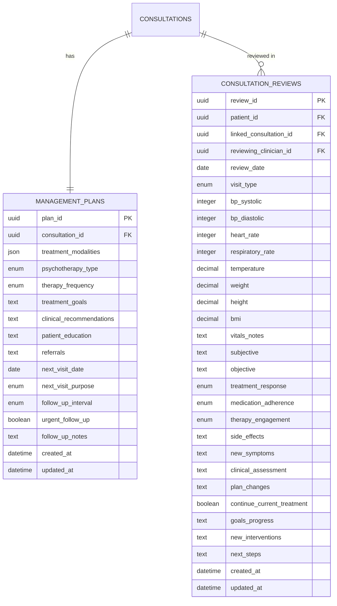
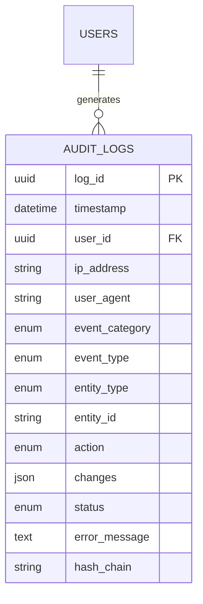

# Data Model

This document defines the database schema and entity relationships for the Mental Health Consultation Web App.

## Entity-Relationship Diagram

### Core Entities Overview

```mermaid
erDiagram
    USERS ||--o{ CONSULTATIONS : "creates/owns"
    USERS ||--o{ CONSULTATION_COLLABORATORS : "collaborates on"
    USERS ||--o{ AUDIT_LOGS : "generates"
    PATIENTS ||--o{ EMERGENCY_CONTACTS : "has"
    PATIENTS ||--o{ CONSULTATIONS : "receives"
    CONSULTATIONS ||--o| MENTAL_STATE_EXAM : "includes"
    CONSULTATIONS ||--o{ DIAGNOSES : "documents"
    CONSULTATIONS ||--o{ CONSULTATION_REVIEWS : "followed by"
    CONSULTATION_COLLABORATORS }o--|| CONSULTATIONS : "links to"
    CONSULTATION_COLLABORATORS }o--|| USERS : "involves"
    
    USERS {
        uuid user_id PK
        string username UK
        string email
        string password_hash
        string first_name
        string last_name
        enum role
        string professional_title
        string license_number
        boolean is_active
        datetime last_login
        datetime created_at
    }
    
    PATIENTS {
        uuid patient_id PK
        string first_name
        string middle_name
        string last_name
        date date_of_birth
        enum gender
        string phone_number
        string email
        string address_line1
        string address_line2
        string city
        string state_province
        string postal_code
        string country
        enum marital_status
        string occupation
        enum education_level
        boolean is_active
        datetime created_at
        uuid created_by FK
    }
    
    EMERGENCY_CONTACTS {
        uuid contact_id PK
        uuid patient_id FK
        string contact_name
        enum relationship
        string phone_number
        string alternate_phone
        string email
        string address
        boolean is_primary
        datetime created_at
    }
    
    CONSULTATIONS {
        uuid consultation_id PK
        uuid patient_id FK
        uuid primary_clinician_id FK
        date consultation_date
        time consultation_time
        enum session_type
        integer session_duration
        text chief_complaint
        text history_present_illness
        text past_psychiatric_history
        text medical_history
        text family_history
        text social_history
        text current_medications
        text allergies
        enum risk_assessment
        boolean safety_plan_required
        text clinical_summary
        text treatment_interventions
        text clinical_notes
        boolean is_locked
        datetime created_at
        datetime updated_at
    }
    
    CONSULTATION_COLLABORATORS {
        uuid collaboration_id PK
        uuid consultation_id FK
        uuid clinician_id FK
        datetime added_at
        uuid added_by FK
    }
    
    MENTAL_STATE_EXAM {
        uuid mse_id PK
        uuid consultation_id FK
        enum general_appearance
        enum level_of_consciousness
        enum eye_contact
        enum psychomotor_activity
        enum attitude_toward_examiner
        text behavior_notes
        enum speech_rate
        enum speech_volume
        enum speech_tone
        enum speech_fluency
        enum speech_articulation
        text speech_notes
        string reported_mood
        enum observed_affect
        enum affect_range
        enum affect_congruence
        text mood_notes
        enum thought_organization
        enum thought_coherence
        json delusions
        text delusion_details
        boolean obsessions
        boolean compulsions
        text phobias
        enum suicidal_ideation
        enum homicidal_ideation
        text thought_notes
        json hallucinations
        text hallucination_details
        boolean illusions
        boolean depersonalization
        boolean derealization
        text perception_notes
        enum orientation_person
        enum orientation_place
        enum orientation_time
        enum orientation_situation
        enum attention_concentration
        enum memory_immediate
        enum memory_recent
        enum memory_remote
        enum fund_of_knowledge
        enum abstraction
        text cognition_notes
        enum insight
        text insight_description
        enum judgment
        text judgment_description
        datetime created_at
        datetime updated_at
    }
    
    DIAGNOSES {
        uuid diagnosis_id PK
        uuid consultation_id FK
        boolean is_primary
        string icd10_code
        string diagnosis_description
        enum diagnosis_status
        enum severity
        date onset_date
        text rationale
        enum likelihood
        datetime created_at
    }
```



### Treatment & Follow-Up Entities



### System & Audit Entities



---

## Detailed Schema Specifications

### Table: `users`

**Purpose**: Store clinician and administrator account information

| Column | Type | Constraints | Default | Description |
|--------|------|-------------|---------|-------------|
| `user_id` | UUID | PRIMARY KEY | gen_random_uuid() | Unique user identifier |
| `username` | VARCHAR(50) | UNIQUE, NOT NULL | - | Login username |
| `email` | VARCHAR(100) | UNIQUE, NOT NULL | - | Email address |
| `password_hash` | VARCHAR(255) | NOT NULL | - | bcrypt hashed password |
| `first_name` | VARCHAR(50) | NOT NULL | - | User's first name |
| `last_name` | VARCHAR(50) | NOT NULL | - | User's last name |
| `role` | ENUM('admin', 'clinician') | NOT NULL | 'clinician' | User role |
| `professional_title` | VARCHAR(20) | NULL | - | e.g., MD, PhD, LCSW |
| `license_number` | VARCHAR(50) | NULL | - | Professional license |
| `phone` | VARCHAR(20) | NULL | - | Contact phone |
| `is_active` | BOOLEAN | NOT NULL | TRUE | Account active status |
| `last_login` | TIMESTAMP | NULL | - | Last successful login |
| `failed_login_attempts` | INTEGER | NOT NULL | 0 | Track for lockout |
| `locked_until` | TIMESTAMP | NULL | - | Account lockout end time |
| `password_changed_at` | TIMESTAMP | NULL | - | Password expiry tracking |
| `created_at` | TIMESTAMP | NOT NULL | CURRENT_TIMESTAMP | Record creation time |
| `created_by` | UUID | FOREIGN KEY(users.user_id) | - | User who created account |

**Indexes**:
- PRIMARY KEY: `user_id`
- UNIQUE: `username`, `email`
- INDEX: `is_active`

**Business Rules**:
- Password must be bcrypt hashed with cost factor 12+
- Username and email must be unique
- At least one admin user must exist in system
- Soft delete via `is_active = FALSE`

---

### Table: `patients`

**Purpose**: Store patient demographic information

| Column | Type | Constraints | Default | Description |
|--------|------|-------------|---------|-------------|
| `patient_id` | UUID | PRIMARY KEY | gen_random_uuid() | Unique patient identifier |
| `first_name` | VARCHAR(50) | NOT NULL | - | Patient first name |
| `middle_name` | VARCHAR(50) | NULL | - | Patient middle name |
| `last_name` | VARCHAR(50) | NOT NULL | - | Patient last name |
| `date_of_birth` | DATE | NOT NULL | - | Date of birth |
| `gender` | ENUM('male', 'female', 'non_binary', 'prefer_not_say', 'other') | NOT NULL | - | Gender identity |
| `phone_number` | VARCHAR(20) | NOT NULL | - | Primary phone |
| `email` | VARCHAR(100) | NULL | - | Email address |
| `address_line1` | VARCHAR(100) | NOT NULL | - | Street address |
| `address_line2` | VARCHAR(100) | NULL | - | Apt/Suite |
| `city` | VARCHAR(50) | NOT NULL | - | City |
| `state_province` | VARCHAR(50) | NOT NULL | - | State/province |
| `postal_code` | VARCHAR(20) | NOT NULL | - | Postal/ZIP code |
| `country` | VARCHAR(50) | NOT NULL | - | Country |
| `marital_status` | ENUM('single', 'married', 'divorced', 'widowed', 'separated') | NULL | - | Marital status |
| `occupation` | VARCHAR(100) | NULL | - | Current occupation |
| `education_level` | ENUM('none', 'primary', 'secondary', 'undergraduate', 'graduate', 'doctoral') | NULL | - | Education |
| `is_active` | BOOLEAN | NOT NULL | TRUE | Active patient status |
| `created_at` | TIMESTAMP | NOT NULL | CURRENT_TIMESTAMP | Record creation |
| `updated_at` | TIMESTAMP | NOT NULL | CURRENT_TIMESTAMP | Last update |
| `created_by` | UUID | FOREIGN KEY(users.user_id) | - | Creating clinician |

**Indexes**:
- PRIMARY KEY: `patient_id`
- INDEX: `last_name`, `first_name`, `date_of_birth` (for duplicate detection)
- INDEX: `is_active`

**Business Rules**:
- Composite unique constraint on (first_name, last_name, date_of_birth) to prevent duplicates
- Age calculated as (CURRENT_DATE - date_of_birth) must be 0-120 years
- Soft delete via `is_active = FALSE`

---

### Table: `emergency_contacts`

**Purpose**: Store patient emergency contact information

| Column | Type | Constraints | Default | Description |
|--------|------|-------------|---------|-------------|
| `contact_id` | UUID | PRIMARY KEY | gen_random_uuid() | Unique contact identifier |
| `patient_id` | UUID | FOREIGN KEY(patients.patient_id), NOT NULL | - | Associated patient |
| `contact_name` | VARCHAR(100) | NOT NULL | - | Contact full name |
| `relationship` | ENUM('spouse', 'parent', 'child', 'sibling', 'friend', 'other') | NOT NULL | - | Relationship to patient |
| `phone_number` | VARCHAR(20) | NOT NULL | - | Primary phone |
| `alternate_phone` | VARCHAR(20) | NULL | - | Alternate phone |
| `email` | VARCHAR(100) | NULL | - | Email address |
| `address` | VARCHAR(200) | NULL | - | Full address (optional) |
| `is_primary` | BOOLEAN | NOT NULL | FALSE | Primary emergency contact |
| `created_at` | TIMESTAMP | NOT NULL | CURRENT_TIMESTAMP | Record creation |

**Indexes**:
- PRIMARY KEY: `contact_id`
- FOREIGN KEY: `patient_id` → `patients.patient_id` ON DELETE CASCADE
- INDEX: `patient_id`

**Business Rules**:
- Each patient must have at least one emergency contact
- Only one contact per patient can have `is_primary = TRUE`
- Deleting patient cascades to emergency contacts

---

### Table: `consultations`

**Purpose**: Store consultation session records

| Column | Type | Constraints | Default | Description |
|--------|------|-------------|---------|-------------|
| `consultation_id` | UUID | PRIMARY KEY | gen_random_uuid() | Unique consultation ID |
| `patient_id` | UUID | FOREIGN KEY(patients.patient_id), NOT NULL | - | Patient receiving care |
| `primary_clinician_id` | UUID | FOREIGN KEY(users.user_id), NOT NULL | - | Primary treating clinician |
| `consultation_date` | DATE | NOT NULL | CURRENT_DATE | Consultation date |
| `consultation_time` | TIME | NOT NULL | - | Consultation time |
| `session_type` | ENUM('initial_assessment', 'follow_up', 'crisis_intervention', 'therapy_session', 'medication_review') | NOT NULL | - | Type of session |
| `session_duration` | INTEGER | NULL | - | Duration in minutes |
| `chief_complaint` | TEXT | NOT NULL | - | Patient's chief complaint |
| `history_present_illness` | TEXT | NOT NULL | - | HPI narrative |
| `past_psychiatric_history` | TEXT | NULL | - | Psychiatric history |
| `medical_history` | TEXT | NULL | - | Medical history |
| `family_history` | TEXT | NULL | - | Family psychiatric/medical history |
| `social_history` | TEXT | NULL | - | Social context |
| `current_medications` | TEXT | NULL | - | Current medications |
| `allergies` | TEXT | NULL | - | Known allergies |
| `risk_assessment` | ENUM('low', 'moderate', 'high') | NOT NULL | - | Risk level |
| `safety_plan_required` | BOOLEAN | NOT NULL | FALSE | Safety plan needed |
| `clinical_summary` | TEXT | NOT NULL | - | Clinical summary |
| `treatment_interventions` | TEXT | NULL | - | Interventions provided |
| `clinical_notes` | TEXT | NULL | - | Free-form notes |
| `is_locked` | BOOLEAN | NOT NULL | FALSE | Read-only after 30 days |
| `created_at` | TIMESTAMP | NOT NULL | CURRENT_TIMESTAMP | Creation timestamp |
| `updated_at` | TIMESTAMP | NOT NULL | CURRENT_TIMESTAMP | Last update |

**Indexes**:
- PRIMARY KEY: `consultation_id`
- FOREIGN KEY: `patient_id` → `patients.patient_id`
- FOREIGN KEY: `primary_clinician_id` → `users.user_id`
- INDEX: `patient_id`, `consultation_date`
- INDEX: `primary_clinician_id`, `consultation_date`

**Business Rules**:
- `consultation_date` cannot be in the future
- If `risk_assessment = 'high'`, management plan must include `next_visit_date` within 14 days
- Consultations become `is_locked = TRUE` after 30 days (configurable)

---

### Table: `consultation_collaborators`

**Purpose**: Track multi-clinician consultations

| Column | Type | Constraints | Default | Description |
|--------|------|-------------|---------|-------------|
| `collaboration_id` | UUID | PRIMARY KEY | gen_random_uuid() | Unique collaboration ID |
| `consultation_id` | UUID | FOREIGN KEY(consultations.consultation_id), NOT NULL | - | Consultation being shared |
| `clinician_id` | UUID | FOREIGN KEY(users.user_id), NOT NULL | - | Collaborating clinician |
| `added_at` | TIMESTAMP | NOT NULL | CURRENT_TIMESTAMP | When added |
| `added_by` | UUID | FOREIGN KEY(users.user_id), NOT NULL | - | Who added collaborator |

**Indexes**:
- PRIMARY KEY: `collaboration_id`
- UNIQUE: (`consultation_id`, `clinician_id`)
- FOREIGN KEY: `consultation_id` → `consultations.consultation_id` ON DELETE CASCADE
- FOREIGN KEY: `clinician_id` → `users.user_id`
- INDEX: `consultation_id`

**Business Rules**:
- Collaborating clinician cannot be same as primary clinician
- Collaborators have same edit rights as primary clinician for that consultation

---

### Table: `mental_state_exam`

**Purpose**: Structured mental state examination data

| Column | Type | Constraints | Default | Description |
|--------|------|-------------|---------|-------------|
| `mse_id` | UUID | PRIMARY KEY | gen_random_uuid() | Unique MSE ID |
| `consultation_id` | UUID | FOREIGN KEY(consultations.consultation_id), UNIQUE, NOT NULL | - | Linked consultation |
| **Appearance & Behavior** | | | | |
| `general_appearance` | ENUM('well_groomed', 'disheveled', 'bizarre', 'age_appropriate', 'inappropriately_dressed') | NOT NULL | - | General appearance |
| `level_of_consciousness` | ENUM('alert', 'drowsy', 'lethargic', 'stuporous', 'comatose') | NOT NULL | - | Consciousness level |
| `eye_contact` | ENUM('appropriate', 'avoidant', 'intense', 'fleeting') | NOT NULL | - | Eye contact quality |
| `psychomotor_activity` | ENUM('normal', 'agitated', 'restless', 'retarded', 'hyperactive', 'catatonic') | NOT NULL | - | Motor activity |
| `attitude_toward_examiner` | ENUM('cooperative', 'guarded', 'hostile', 'suspicious', 'evasive', 'seductive') | NOT NULL | - | Attitude |
| `behavior_notes` | TEXT | NULL | - | Additional observations |
| **Speech & Language** | | | | |
| `speech_rate` | ENUM('normal', 'rapid', 'slow', 'pressured') | NOT NULL | - | Speech rate |
| `speech_volume` | ENUM('normal', 'loud', 'soft', 'whispered') | NOT NULL | - | Speech volume |
| `speech_tone` | ENUM('normal', 'monotone', 'dramatic', 'flat') | NOT NULL | - | Speech tone |
| `speech_fluency` | ENUM('fluent', 'non_fluent', 'hesitant', 'stuttering') | NOT NULL | - | Fluency |
| `speech_articulation` | ENUM('clear', 'slurred', 'mumbled') | NOT NULL | - | Articulation |
| `speech_notes` | TEXT | NULL | - | Additional speech observations |
| **Mood & Affect** | | | | |
| `reported_mood` | VARCHAR(100) | NOT NULL | - | Patient's stated mood |
| `observed_affect` | ENUM('euthymic', 'depressed', 'anxious', 'irritable', 'euphoric', 'angry', 'labile') | NOT NULL | - | Observed affect |
| `affect_range` | ENUM('full', 'restricted', 'blunted', 'flat') | NOT NULL | - | Affect range |
| `affect_congruence` | ENUM('congruent', 'incongruent') | NOT NULL | - | Mood/affect match |
| `mood_notes` | TEXT | NULL | - | Mood observations |
| **Thought Process/Content** | | | | |
| `thought_organization` | ENUM('logical', 'goal_directed', 'circumstantial', 'tangential', 'loose_associations', 'flight_of_ideas', 'thought_blocking') | NOT NULL | - | Organization |
| `thought_coherence` | ENUM('coherent', 'incoherent', 'disorganized') | NOT NULL | - | Coherence |
| `delusions` | JSON | NULL | - | Array of delusion types |
| `delusion_details` | TEXT | NULL | - | Description |
| `obsessions` | BOOLEAN | NOT NULL | FALSE | Intrusive thoughts |
| `compulsions` | BOOLEAN | NOT NULL | FALSE | Repetitive behaviors |
| `phobias` | TEXT | NULL | - | Specific fears |
| `suicidal_ideation` | ENUM('none', 'passive', 'active_no_plan', 'active_with_plan', 'active_with_intent') | NOT NULL | - | SI assessment |
| `homicidal_ideation` | ENUM('none', 'passive', 'active_no_plan', 'active_with_plan', 'active_with_intent') | NOT NULL | - | HI assessment |
| `thought_notes` | TEXT | NULL | - | Thought observations |
| **Perception** | | | | |
| `hallucinations` | JSON | NULL | - | Array of hallucination types |
| `hallucination_details` | TEXT | NULL | - | Description |
| `illusions` | BOOLEAN | NOT NULL | FALSE | Misperceptions |
| `depersonalization` | BOOLEAN | NOT NULL | FALSE | Detachment from self |
| `derealization` | BOOLEAN | NOT NULL | FALSE | Unreality feelings |
| `perception_notes` | TEXT | NULL | - | Perception observations |
| **Cognition & Sensorium** | | | | |
| `orientation_person` | ENUM('oriented', 'disoriented') | NOT NULL | - | Person orientation |
| `orientation_place` | ENUM('oriented', 'disoriented') | NOT NULL | - | Place orientation |
| `orientation_time` | ENUM('oriented', 'disoriented') | NOT NULL | - | Time orientation |
| `orientation_situation` | ENUM('oriented', 'disoriented') | NOT NULL | - | Situation orientation |
| `attention_concentration` | ENUM('intact', 'impaired', 'grossly_impaired') | NOT NULL | - | Attention |
| `memory_immediate` | ENUM('intact', 'impaired', 'grossly_impaired') | NOT NULL | - | Immediate recall |
| `memory_recent` | ENUM('intact', 'impaired', 'grossly_impaired') | NOT NULL | - | Recent memory |
| `memory_remote` | ENUM('intact', 'impaired', 'grossly_impaired') | NOT NULL | - | Remote memory |
| `fund_of_knowledge` | ENUM('average', 'above_average', 'below_average') | NULL | - | General knowledge |
| `abstraction` | ENUM('intact', 'concrete', 'impaired') | NULL | - | Abstract thinking |
| `cognition_notes` | TEXT | NULL | - | Cognition observations |
| **Insight & Judgment** | | | | |
| `insight` | ENUM('good', 'fair', 'poor', 'absent') | NOT NULL | - | Illness awareness |
| `insight_description` | TEXT | NULL | - | Insight details |
| `judgment` | ENUM('good', 'fair', 'poor', 'grossly_impaired') | NOT NULL | - | Decision-making |
| `judgment_description` | TEXT | NULL | - | Judgment details |
| **Metadata** | | | | |
| `created_at` | TIMESTAMP | NOT NULL | CURRENT_TIMESTAMP | Creation time |
| `updated_at` | TIMESTAMP | NOT NULL | CURRENT_TIMESTAMP | Last update |

**Indexes**:
- PRIMARY KEY: `mse_id`
- UNIQUE: `consultation_id`
- FOREIGN KEY: `consultation_id` → `consultations.consultation_id` ON DELETE CASCADE

**Business Rules**:
- One MSE per consultation (1:1 relationship)
- If `suicidal_ideation` or `homicidal_ideation` is not 'none', requires additional safety documentation
- JSON fields store arrays (e.g., ["persecutory", "grandiose"])

---

### Table: `diagnoses`

**Purpose**: Store diagnostic impressions (primary and differential)

| Column | Type | Constraints | Default | Description |
|--------|------|-------------|---------|-------------|
| `diagnosis_id` | UUID | PRIMARY KEY | gen_random_uuid() | Unique diagnosis ID |
| `consultation_id` | UUID | FOREIGN KEY(consultations.consultation_id), NOT NULL | - | Linked consultation |
| `is_primary` | BOOLEAN | NOT NULL | - | Primary vs. differential |
| `icd10_code` | VARCHAR(10) | NOT NULL | - | ICD-10 diagnosis code |
| `diagnosis_description` | VARCHAR(500) | NOT NULL | - | Diagnosis text |
| `diagnosis_status` | ENUM('provisional', 'confirmed', 'rule_out') | NOT NULL | - | Diagnosis certainty |
| `severity` | ENUM('mild', 'moderate', 'severe') | NULL | - | Severity if applicable |
| `onset_date` | DATE | NULL | - | Symptom onset |
| `rationale` | TEXT | NULL | - | Why considered (differential) |
| `likelihood` | ENUM('high', 'moderate', 'low') | NULL | - | Likelihood (differential) |
| `created_at` | TIMESTAMP | NOT NULL | CURRENT_TIMESTAMP | Creation time |

**Indexes**:
- PRIMARY KEY: `diagnosis_id`
- FOREIGN KEY: `consultation_id` → `consultations.consultation_id` ON DELETE CASCADE
- INDEX: `consultation_id`, `is_primary`
- INDEX: `icd10_code`

**Business Rules**:
- Each consultation must have exactly one diagnosis with `is_primary = TRUE`
- `icd10_code` must be valid ICD-10 format
- Up to 10 differential diagnoses (is_primary = FALSE) per consultation

---

### Table: `management_plans`

**Purpose**: Treatment plans and follow-up scheduling

| Column | Type | Constraints | Default | Description |
|--------|------|-------------|---------|-------------|
| `plan_id` | UUID | PRIMARY KEY | gen_random_uuid() | Unique plan ID |
| `consultation_id` | UUID | FOREIGN KEY(consultations.consultation_id), UNIQUE, NOT NULL | - | Linked consultation |
| `treatment_modalities` | JSON | NOT NULL | - | Array of modalities |
| `psychotherapy_type` | ENUM('cbt', 'dbt', 'psychodynamic', 'supportive', 'motivational_interviewing', 'other') | NULL | - | Therapy type |
| `therapy_frequency` | ENUM('weekly', 'biweekly', 'monthly', 'as_needed') | NULL | - | Session frequency |
| `treatment_goals` | TEXT | NOT NULL | - | Measurable goals |
| `clinical_recommendations` | TEXT | NOT NULL | - | Specific actions |
| `patient_education` | TEXT | NULL | - | Education provided |
| `referrals` | TEXT | NULL | - | External referrals |
| `next_visit_date` | DATE | NULL | - | Scheduled follow-up |
| `next_visit_purpose` | ENUM('medication_review', 'therapy_session', 'progress_check', 'crisis_followup', 'discharge_planning') | NULL | - | Visit purpose |
| `follow_up_interval` | ENUM('1_week', '2_weeks', '1_month', '3_months', '6_months', 'as_needed') | NULL | - | Interval |
| `urgent_follow_up` | BOOLEAN | NOT NULL | FALSE | Expedited scheduling |
| `follow_up_notes` | TEXT | NULL | - | Special instructions |
| `created_at` | TIMESTAMP | NOT NULL | CURRENT_TIMESTAMP | Creation time |
| `updated_at` | TIMESTAMP | NOT NULL | CURRENT_TIMESTAMP | Last update |

**Indexes**:
- PRIMARY KEY: `plan_id`
- UNIQUE: `consultation_id`
- FOREIGN KEY: `consultation_id` → `consultations.consultation_id` ON DELETE CASCADE

**Business Rules**:
- One management plan per consultation (1:1 relationship)
- If `consultations.risk_assessment = 'high'`, `next_visit_date` must be within 14 days
- JSON field stores array of modalities (e.g., ["psychotherapy", "medication_management"])

---

### Table: `consultation_reviews`

**Purpose**: Follow-up visit documentation and progress tracking

| Column | Type | Constraints | Default | Description |
|--------|------|-------------|---------|-------------|
| `review_id` | UUID | PRIMARY KEY | gen_random_uuid() | Unique review ID |
| `patient_id` | UUID | FOREIGN KEY(patients.patient_id), NOT NULL | - | Patient |
| `linked_consultation_id` | UUID | FOREIGN KEY(consultations.consultation_id), NOT NULL | - | Original consultation |
| `reviewing_clinician_id` | UUID | FOREIGN KEY(users.user_id), NOT NULL | - | Reviewing clinician |
| `review_date` | DATE | NOT NULL | CURRENT_DATE | Review date |
| `visit_type` | ENUM('scheduled_followup', 'unscheduled', 'crisis_visit', 'medication_check') | NOT NULL | - | Visit type |
| **Vitals** | | | | |
| `bp_systolic` | INTEGER | NULL, CHECK(bp_systolic BETWEEN 50 AND 250) | - | Systolic BP (mmHg) |
| `bp_diastolic` | INTEGER | NULL, CHECK(bp_diastolic BETWEEN 30 AND 150) | - | Diastolic BP (mmHg) |
| `heart_rate` | INTEGER | NULL, CHECK(heart_rate BETWEEN 30 AND 200) | - | HR (bpm) |
| `respiratory_rate` | INTEGER | NULL, CHECK(respiratory_rate BETWEEN 8 AND 40) | - | RR (breaths/min) |
| `temperature` | DECIMAL(4,1) | NULL, CHECK(temperature BETWEEN 35 AND 41) | - | Temp (°C) |
| `weight` | DECIMAL(5,2) | NULL, CHECK(weight BETWEEN 20 AND 250) | - | Weight (kg) |
| `height` | DECIMAL(5,2) | NULL, CHECK(height BETWEEN 120 AND 240) | - | Height (cm) |
| `bmi` | DECIMAL(4,1) | NULL | - | Auto-calculated BMI |
| `vitals_notes` | TEXT | NULL | - | Abnormalities |
| **Progress Assessment** | | | | |
| `subjective` | TEXT | NOT NULL | - | Patient report |
| `objective` | TEXT | NOT NULL | - | Clinician observation |
| `treatment_response` | ENUM('significant_improvement', 'moderate_improvement', 'minimal_improvement', 'no_change', 'worsening') | NOT NULL | - | Response |
| `medication_adherence` | ENUM('fully_adherent', 'mostly_adherent', 'partially_adherent', 'non_adherent', 'na') | NULL | - | Adherence |
| `therapy_engagement` | ENUM('excellent', 'good', 'fair', 'poor', 'na') | NULL | - | Engagement |
| `side_effects` | TEXT | NULL | - | Side effects |
| `new_symptoms` | TEXT | NULL | - | New/worsening symptoms |
| **Assessment & Plan** | | | | |
| `clinical_assessment` | TEXT | NOT NULL | - | Updated assessment |
| `plan_changes` | TEXT | NULL | - | Plan modifications |
| `continue_current_treatment` | BOOLEAN | NOT NULL | FALSE | No changes |
| `goals_progress` | TEXT | NULL | - | Goal progress |
| `new_interventions` | TEXT | NULL | - | New treatments |
| `next_steps` | TEXT | NOT NULL | - | Plan until next visit |
| **Metadata** | | | | |
| `created_at` | TIMESTAMP | NOT NULL | CURRENT_TIMESTAMP | Creation time |
| `updated_at` | TIMESTAMP | NOT NULL | CURRENT_TIMESTAMP | Last update |

**Indexes**:
- PRIMARY KEY: `review_id`
- FOREIGN KEY: `patient_id` → `patients.patient_id`
- FOREIGN KEY: `linked_consultation_id` → `consultations.consultation_id`
- FOREIGN KEY: `reviewing_clinician_id` → `users.user_id`
- INDEX: `patient_id`, `review_date`

**Business Rules**:
- `bmi` auto-calculated as `weight / (height/100)^2` if both weight and height provided
- Each review must link to a valid consultation
- Multiple reviews can link to same consultation (ongoing care)

---

### Table: `audit_logs`

**Purpose**: Immutable audit trail for compliance

| Column | Type | Constraints | Default | Description |
|--------|------|-------------|---------|-------------|
| `log_id` | UUID | PRIMARY KEY | gen_random_uuid() | Unique log ID |
| `timestamp` | TIMESTAMP | NOT NULL | CURRENT_TIMESTAMP | Event time (UTC) |
| `user_id` | UUID | FOREIGN KEY(users.user_id), NULL | - | User (NULL for system events) |
| `ip_address` | VARCHAR(45) | NULL | - | Source IP (IPv4/IPv6) |
| `user_agent` | VARCHAR(255) | NULL | - | Browser/client info |
| `event_category` | ENUM('authentication', 'patient_records', 'clinical_data', 'data_access', 'reports', 'system_admin') | NOT NULL | - | Event category |
| `event_type` | VARCHAR(50) | NOT NULL | - | Specific event |
| `entity_type` | ENUM('user', 'patient', 'consultation', 'mse', 'diagnosis', 'review', 'system') | NULL | - | Affected entity type |
| `entity_id` | VARCHAR(255) | NULL | - | Affected record ID |
| `action` | ENUM('create', 'read', 'update', 'delete', 'login', 'logout', 'export') | NOT NULL | - | Action performed |
| `changes` | JSON | NULL | - | Before/after for updates |
| `status` | ENUM('success', 'failure', 'partial') | NOT NULL | - | Result |
| `error_message` | TEXT | NULL | - | Error if failed |
| `hash_chain` | VARCHAR(64) | NOT NULL | - | SHA-256 hash for tamper detection |

**Indexes**:
- PRIMARY KEY: `log_id`
- INDEX: `timestamp DESC`
- INDEX: `user_id`, `timestamp DESC`
- INDEX: `entity_type`, `entity_id`
- INDEX: `event_category`, `event_type`

**Business Rules**:
- Append-only table (no UPDATEs or DELETEs allowed)
- `hash_chain` = SHA256(log_id + timestamp + previous_hash + user_id + event_type + entity_id)
- Minimum 7-year retention
- Archive old logs to cold storage after 1 year (configurable)

---

## Relationships Summary

### One-to-Many (1:N)

| Parent Entity | Child Entity | Cardinality | Notes |
|---------------|--------------|-------------|-------|
| `patients` | `emergency_contacts` | 1:N | Patient has multiple contacts |
| `patients` | `consultations` | 1:N | Patient has multiple consultations |
| `users` | `consultations` | 1:N | Clinician owns multiple consultations |
| `consultations` | `diagnoses` | 1:N | Consultation has multiple diagnoses |
| `consultations` | `consultation_reviews` | 1:N | Consultation has multiple reviews |
| `users` | `audit_logs` | 1:N | User generates multiple log entries |

### One-to-One (1:1)

| Entity A | Entity B | Notes |
|----------|----------|-------|
| `consultations` | `mental_state_exam` | Each consultation has at most one MSE |
| `consultations` | `management_plans` | Each consultation has one management plan |

### Many-to-Many (M:N)

| Entity A | Entity B | Junction Table | Notes |
|----------|----------|----------------|-------|
| `consultations` | `users` (clinicians) | `consultation_collaborators` | Multi-clinician consultations |

---

## Database Constraints & Triggers

### Foreign Key Constraints

```sql
-- Cascade delete for child records
ALTER TABLE emergency_contacts
  ADD CONSTRAINT fk_patient_contacts
  FOREIGN KEY (patient_id) REFERENCES patients(patient_id)
  ON DELETE CASCADE;

ALTER TABLE mental_state_exam
  ADD CONSTRAINT fk_consultation_mse
  FOREIGN KEY (consultation_id) REFERENCES consultations(consultation_id)
  ON DELETE CASCADE;

-- Restrict delete if referenced (protect data integrity)
ALTER TABLE consultations
  ADD CONSTRAINT fk_consultation_patient
  FOREIGN KEY (patient_id) REFERENCES patients(patient_id)
  ON DELETE RESTRICT;
```

### Check Constraints

```sql
-- Age validation
ALTER TABLE patients
  ADD CONSTRAINT chk_age
  CHECK (EXTRACT(YEAR FROM AGE(date_of_birth)) BETWEEN 0 AND 120);

-- Vitals range validation
ALTER TABLE consultation_reviews
  ADD CONSTRAINT chk_bp_systolic
  CHECK (bp_systolic IS NULL OR (bp_systolic BETWEEN 50 AND 250));

-- Primary diagnosis requirement
ALTER TABLE consultations
  ADD CONSTRAINT chk_primary_diagnosis
  CHECK (EXISTS (
    SELECT 1 FROM diagnoses
    WHERE diagnoses.consultation_id = consultations.consultation_id
    AND diagnoses.is_primary = TRUE
  ));
```

### Triggers

```sql
-- Auto-calculate BMI
CREATE TRIGGER calculate_bmi
BEFORE INSERT OR UPDATE ON consultation_reviews
FOR EACH ROW
WHEN (NEW.weight IS NOT NULL AND NEW.height IS NOT NULL)
EXECUTE FUNCTION calculate_bmi_function();

-- Lock consultations after 30 days
CREATE TRIGGER lock_old_consultations
BEFORE UPDATE ON consultations
FOR EACH ROW
WHEN (NEW.created_at < CURRENT_TIMESTAMP - INTERVAL '30 days')
EXECUTE FUNCTION set_consultation_locked();

-- Generate hash chain for audit logs
CREATE TRIGGER generate_audit_hash
BEFORE INSERT ON audit_logs
FOR EACH ROW
EXECUTE FUNCTION generate_hash_chain();

-- Auto-update updated_at timestamps
CREATE TRIGGER update_timestamp
BEFORE UPDATE ON consultations
FOR EACH ROW
EXECUTE FUNCTION update_modified_timestamp();
```

---

## Data Retention & Archival

| Data Type | Retention Period | Archive Strategy |
|-----------|------------------|------------------|
| **Active Patient Records** | Indefinite | Keep in primary database |
| **Inactive Patients** (no consultation in 5+ years) | 7 years after last visit | Move to archive database |
| **Audit Logs** | 7 years minimum | Archive to cold storage after 1 year |
| **Deleted Records** (soft delete) | 7 years | Marked `is_active = FALSE`, not purged |

---

## Backup & Recovery

### Backup Strategy

- **Full Backup**: Daily at 2:00 AM (system-wide)
- **Incremental Backup**: Every 4 hours
- **Transaction Log Backup**: Every 15 minutes (point-in-time recovery)
- **Backup Retention**: 30 days online, 7 years offline/archive

### Encryption

- **Data at Rest**: AES-256 full database encryption
- **Backups**: Encrypted with separate keys
- **Key Management**: External key management service with rotation every 90 days

---

**Next Steps**: Review [Workflow Diagrams](04-workflow-diagrams.md) for visual process flows.
