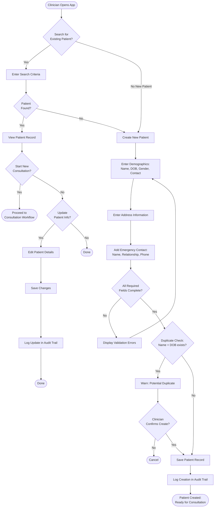
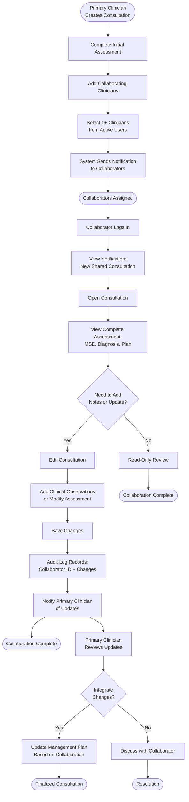
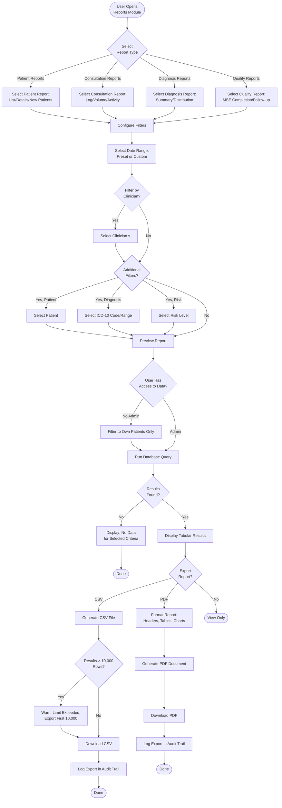
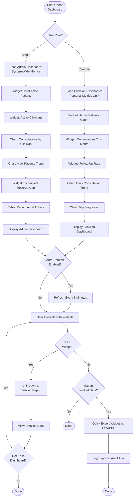
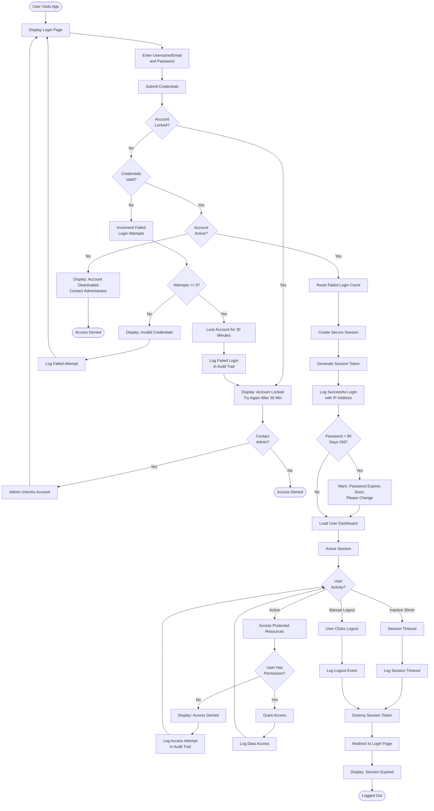
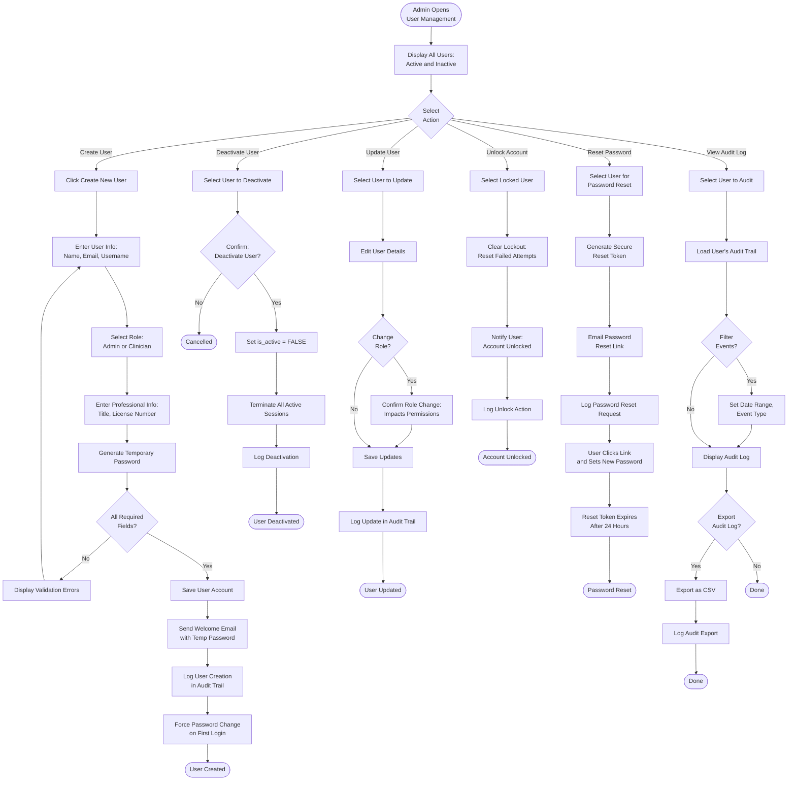
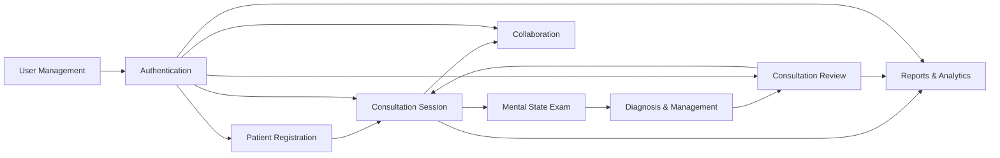

# Workflow Diagrams

This document provides visual workflows for key clinical and administrative processes in the Mental Health Consultation Web App.

---

## 1. Patient Registration Workflow

**Key Decision Points**:
- Duplicate detection prevents creating multiple records for same patient
- At least one emergency contact required before saving
- All patient creations and updates logged for audit compliance

---

## 2. Consultation Session Workflow

```mermaid
flowchart TD
    Start([Select Patient]) --> CreateConsult[Create New Consultation]
    CreateConsult --> EnterHeader[Enter Header Info:<br/>Date, Time, Session Type]
    EnterHeader --> ChiefComplaint[Document Chief Complaint]
    ChiefComplaint --> HPI[Document History of<br/>Present Illness]
    HPI --> Background[Enter Background Info:<br/>Psych History, Medical History,<br/>Family/Social History]
    Background --> CurrentMeds[List Current Medications<br/>and Allergies]
    CurrentMeds --> AssessRisk[Assess Risk Level:<br/>Low/Moderate/High]
    
    AssessRisk --> HighRisk{Risk = High?}
    HighRisk -->|Yes| SafetyPlan[Create Safety Plan]
    SafetyPlan --> CompleteMSE
    HighRisk -->|No| CompleteMSE[Complete Mental State Exam]
    
    CompleteMSE --> MSE_App[MSE: Appearance & Behavior]
    MSE_App --> MSE_Speech[MSE: Speech & Language]
    MSE_Speech --> MSE_Mood[MSE: Mood & Affect]
    MSE_Mood --> MSE_Thought[MSE: Thought Process/Content]
    MSE_Thought --> MSE_Perc[MSE: Perception]
    MSE_Perc --> MSE_Cog[MSE: Cognition & Sensorium]
    MSE_Cog --> MSE_Insight[MSE: Insight & Judgment]
    
    MSE_Insight --> SuicidalCheck{Suicidal or<br/>Homicidal Ideation?}
    SuicidalCheck -->|Yes| AdditionalSafety[Document Safety Measures]
    AdditionalSafety --> Diagnosis
    SuicidalCheck -->|No| Diagnosis[Document Diagnosis]
    
    Diagnosis --> PrimaryDx[Enter Primary Diagnosis:<br/>ICD-10 Code + Description]
    PrimaryDx --> DifferentialOpt{Add Differential<br/>Diagnoses?}
    DifferentialOpt -->|Yes| DifferentialDx[Enter Differential Dx<br/>with Rationale]
    DifferentialDx --> ManagementPlan
    DifferentialOpt -->|No| ManagementPlan[Create Management Plan]
    
    ManagementPlan --> TreatmentMod[Select Treatment Modalities:<br/>Therapy, Medication, etc.]
    TreatmentMod --> Goals[Document Treatment Goals]
    Goals --> Recommendations[Enter Clinical Recommendations]
    Recommendations --> FollowUp[Schedule Next Visit]
    
    FollowUp --> HighRiskFollow{High Risk<br/>Patient?}
    HighRiskFollow -->|Yes| UrgentFollow[Require Follow-up<br/>within 14 days]
    UrgentFollow --> Summary
    HighRiskFollow -->|No| Summary[Write Clinical Summary]
    
    Summary --> Collab{Add<br/>Collaborating<br/>Clinicians?}
    Collab -->|Yes| AddCollab[Select Collaborators]
    AddCollab --> NotifyCollab[Notify Collaborators]
    NotifyCollab --> SaveConsult
    Collab -->|No| SaveConsult[Save Consultation]
    
    SaveConsult --> LogConsult[Log in Audit Trail]
    LogConsult --> PrintOpt{Generate<br/>PDF Summary?}
    PrintOpt -->|Yes| GeneratePDF[Create PDF Report]
    GeneratePDF --> End1([Consultation Complete])
    PrintOpt -->|No| End2([Consultation Complete])
```

**Critical Requirements**:
- Chief complaint mandatory before saving
- MSE completion ensures comprehensive assessment
- High-risk patients require follow-up within 14 days
- Primary diagnosis required for consultation completion

---

## 3. Multi-Clinician Collaboration Workflow

**Collaboration Features**:
- All collaborators have equal edit rights for shared consultation
- Audit trail tracks specific clinician for each edit
- Notifications ensure timely communication
- Primary clinician retains ownership and final decision authority

---

## 4. Consultation Review (Follow-Up) Workflow

```mermaid
flowchart TD
    Start([Patient Returns<br/>for Follow-Up]) --> SelectPatient[Select Patient]
    SelectPatient --> ViewHistory[View Consultation History]
    ViewHistory --> SelectConsult[Select Original Consultation<br/>to Review]
    SelectConsult --> CreateReview[Create Consultation Review]
    
    CreateReview --> EnterDate[Enter Review Date]
    EnterDate --> SelectType[Select Visit Type:<br/>Scheduled/Unscheduled/Crisis]
    SelectType --> Vitals[Record Vital Signs:<br/>BP, HR, Weight, etc.]
    Vitals --> AutoCalc[System Auto-Calculates BMI]
    AutoCalc --> ChartVitals[Display Vital Trends Chart]
    
    ChartVitals --> Subjective[Document Subjective:<br/>Patient's Report of Progress]
    Subjective --> Objective[Document Objective:<br/>Clinician's Observations]
    Objective --> AssessResponse[Assess Treatment Response:<br/>Improvement/No Change/Worsening]
    
    AssessResponse --> Improved{Significant<br/>Improvement?}
    Improved -->|Yes| ContinuePlan[Continue Current Treatment]
    ContinuePlan --> SetGoals
    Improved -->|No| Worsened{Worsening<br/>or No Change?}
    Worsened -->|Yes| ModifyPlan[Modify Treatment Plan]
    ModifyPlan --> NewInterventions[Document New Interventions]
    NewInterventions --> SetGoals
    Worsened -->|No| MinorAdjust[Minor Plan Adjustments]
    MinorAdjust --> SetGoals[Update Progress Toward Goals]
    
    SetGoals --> Adherence{Assess<br/>Adherence}
    Adherence --> MedAdherence[Rate Medication Adherence]
    MedAdherence --> TherapyEng[Rate Therapy Engagement]
    TherapyEng --> SideEffects{Any Side Effects<br/>or New Symptoms?}
    SideEffects -->|Yes| DocumentSE[Document Side Effects/<br/>New Symptoms]
    DocumentSE --> ClinicalAssess
    SideEffects -->|No| ClinicalAssess[Write Updated<br/>Clinical Assessment]
    
    ClinicalAssess --> NextSteps[Document Next Steps<br/>Until Next Visit]
    NextSteps --> ScheduleNext{Schedule<br/>Next Visit?}
    ScheduleNext -->|Yes| SetNextDate[Set Next Visit Date]
    SetNextDate --> CreateNextConsult{Create Next<br/>Consultation Now?}
    CreateNextConsult -->|Yes| NewConsult([Start New Consultation<br/>Workflow])
    CreateNextConsult -->|No| SaveReview
    ScheduleNext -->|No| DischargeOpt{Discharge<br/>Patient?}
    DischargeOpt -->|Yes| DischargePlan[Document Discharge Plan]
    DischargePlan --> SaveReview
    DischargeOpt -->|No| SaveReview[Save Consultation Review]
    
    SaveReview --> LogReview[Log Review in Audit Trail]
    LogReview --> PrintOpt{Print Progress<br/>Summary?}
    PrintOpt -->|Yes| GeneratePDF[Create PDF Progress Report]
    GeneratePDF --> End1([Review Complete])
    PrintOpt -->|No| End2([Review Complete])
```

**Key Features**:
- Vital trends displayed graphically for clinical decision-making
- Treatment response assessment guides plan adjustments
- Automatic BMI calculation from height and weight
- Progress notes link back to original consultation for context

---

## 5. Reporting & Analytics Workflow

### Report Generation

### Dashboard Viewing

**Reporting Features**:
- Role-based data filtering (clinicians see own data, admins see all)
- 10,000-row export limit for CSV to prevent performance issues
- All exports logged in audit trail for compliance
- Dashboards auto-refresh for real-time insights

---

## 6. Authentication & Security Workflow

**Security Controls**:
- 5 failed attempts trigger 30-minute account lockout
- Session timeout after 30 minutes of inactivity
- All login attempts (success and failure) logged with IP address
- Password expiry warning at 90 days

---

## 7. User Management Workflow (Admin Only)

**Admin Controls**:
- Only admins can create, deactivate, or modify user roles
- Password resets use secure time-limited tokens (24-hour expiry)
- Deactivating user immediately terminates all active sessions
- All admin actions comprehensively logged

---

## Integration Summary

### Workflow Interconnections

### Typical End-to-End Patient Journey

1. **Intake**: Patient registered → Demographics captured → Emergency contact added
2. **Initial Assessment**: Consultation created → MSE completed → Diagnosis documented → Treatment plan established
3. **Collaboration** (if needed): Collaborating clinicians added → Shared review and input → Integrated care plan
4. **Follow-Up**: Patient returns → Review created → Vitals recorded → Progress assessed → Plan adjusted
5. **Ongoing Care**: Repeat reviews → Treatment modifications → Goal progress tracking
6. **Reporting**: Clinician generates reports → Analyzes outcomes → Quality improvement

---

**Next Steps**: Review [Roles & Permissions](05-roles-permissions.md) for access control specifications.
