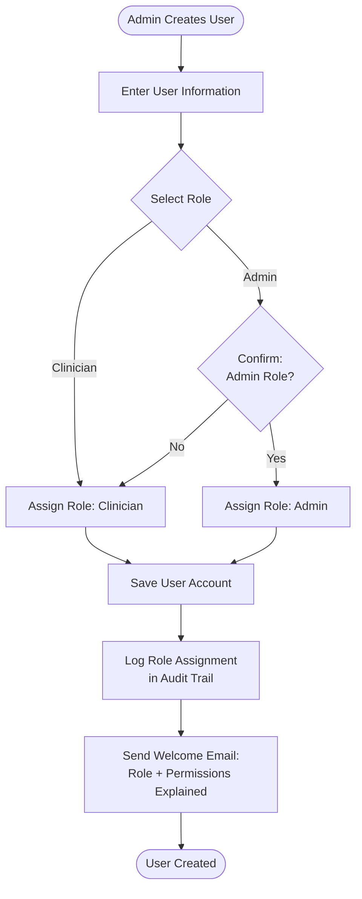

# Roles & Permissions

This document defines user roles, permission matrices, and access control rules for the Mental Health Consultation Web App.

---

## User Roles

### 1. Clinician

**Description**: Licensed mental health professionals who provide direct patient care and clinical documentation.

**Typical Users**:
- Psychiatrists
- Psychologists
- Licensed Clinical Social Workers (LCSW)
- Mental Health Counselors (LPC, LMHC)
- Psychiatric Nurse Practitioners

**Primary Responsibilities**:
- Patient registration and demographic management
- Clinical consultation documentation
- Mental state examinations
- Diagnosis and treatment planning
- Progress reviews and follow-up care
- Personal clinical reporting

**Access Scope**:
- Own patients (created by self)
- Collaborative consultations (added as collaborator)
- Personal dashboard and reports
- No access to system administration or other clinicians' data

---

### 2. Admin

**Description**: Clinical administrators and IT staff with system-wide oversight and configuration authority.

**Typical Users**:
- Clinical Directors
- Practice Managers
- IT Administrators
- Compliance Officers

**Primary Responsibilities**:
- User account management (create, update, deactivate users)
- Role assignment and permission management
- System configuration and settings
- Audit log review and compliance monitoring
- System-wide reporting and analytics
- Data integrity oversight

**Access Scope**:
- All patient records and consultations (read access)
- All users and audit logs
- System configuration settings
- Full reporting across all clinicians
- Delete permissions for data management

---

## Permission Matrix

### Patient Management Module

| Operation | Description | Clinician | Admin |
|-----------|-------------|-----------|-------|
| **Create Patient** | Register new patient | ✅ | ✅ |
| **View Own Patients** | View patients created by self | ✅ | ✅ |
| **View All Patients** | View any patient in system | ❌ | ✅ |
| **Update Patient** | Modify patient demographics/contacts | ✅ (own only) | ✅ (all) |
| **Delete Patient** | Soft delete (archive) patient record | ❌ | ✅ |
| **Search Patients** | Search patient database | ✅ (own only) | ✅ (all) |
| **View Patient History** | Access full consultation history | ✅ (own + collaborative) | ✅ (all) |
| **Export Patient List** | Export patient data to CSV/PDF | ✅ (own only) | ✅ (all) |

---

### Consultation Management Module

| Operation | Description | Clinician | Admin |
|-----------|-------------|-----------|-------|
| **Create Consultation** | Initiate new consultation session | ✅ | ✅ |
| **View Own Consultations** | View consultations where primary clinician | ✅ | ✅ |
| **View Collaborative Consultations** | View consultations as collaborator | ✅ | ✅ |
| **View All Consultations** | View any consultation in system | ❌ | ✅ |
| **Update Consultation** | Edit consultation notes | ✅ (own + collaborative) | ✅ (all) |
| **Delete Consultation** | Soft delete consultation | ❌ | ✅ |
| **Add Collaborators** | Add clinicians to consultation | ✅ (own only) | ✅ (all) |
| **Remove Collaborators** | Remove clinicians from consultation | ✅ (own only) | ✅ (all) |
| **Lock Consultation** | Make consultation read-only | 🔶 Auto after 30 days | ✅ Manual override |
| **Unlock Consultation** | Reopen locked consultation | ❌ | ✅ |
| **Export Consultation** | Generate PDF summary | ✅ (own + collaborative) | ✅ (all) |

**Legend**: 🔶 = Conditional/Automated

---

### Mental State Examination (MSE) Module

| Operation | Description | Clinician | Admin |
|-----------|-------------|-----------|-------|
| **Create MSE** | Complete MSE for consultation | ✅ (own + collaborative) | ✅ (all) |
| **View MSE** | View completed MSE | ✅ (own + collaborative) | ✅ (all) |
| **Update MSE** | Modify MSE findings | ✅ (own + collaborative) | ✅ (all) |
| **Delete MSE** | Remove MSE entry | ❌ | ✅ |
| **View MSE History** | Compare MSEs over time for patient | ✅ (own + collaborative) | ✅ (all) |
| **Export MSE** | Print MSE summary | ✅ (own + collaborative) | ✅ (all) |

---

### Diagnosis & Management Module

| Operation | Description | Clinician | Admin |
|-----------|-------------|-----------|-------|
| **Create Diagnosis** | Document primary/differential diagnosis | ✅ (own + collaborative) | ✅ (all) |
| **View Diagnosis** | View diagnosis history | ✅ (own + collaborative) | ✅ (all) |
| **Update Diagnosis** | Modify diagnosis or status | ✅ (own + collaborative) | ✅ (all) |
| **Delete Diagnosis** | Remove diagnosis entry | ❌ | ✅ |
| **Create Management Plan** | Document treatment plan | ✅ (own + collaborative) | ✅ (all) |
| **Update Management Plan** | Modify treatment plan | ✅ (own + collaborative) | ✅ (all) |
| **Schedule Follow-Up** | Set next visit date | ✅ (own + collaborative) | ✅ (all) |
| **View Diagnosis Trends** | Patient diagnosis history over time | ✅ (own + collaborative) | ✅ (all) |

---

### Consultation Review Module

| Operation | Description | Clinician | Admin |
|-----------|-------------|-----------|-------|
| **Create Review** | Document follow-up visit | ✅ (own + collaborative) | ✅ (all) |
| **View Review** | View progress notes | ✅ (own + collaborative) | ✅ (all) |
| **Update Review** | Modify review notes | ✅ (own + collaborative) | ✅ (all) |
| **Delete Review** | Remove review entry | ❌ | ✅ |
| **Record Vitals** | Enter vital signs | ✅ (own + collaborative) | ✅ (all) |
| **View Vital Trends** | Graph vitals over time | ✅ (own + collaborative) | ✅ (all) |
| **Export Progress Summary** | Generate PDF progress report | ✅ (own + collaborative) | ✅ (all) |

---

### Reports & Analytics Module

| Operation | Description | Clinician | Admin |
|-----------|-------------|-----------|-------|
| **Generate Patient Reports** | Patient lists, details, new patients | ✅ (own data) | ✅ (all data) |
| **Generate Consultation Reports** | Consultation logs, volume, activity | ✅ (own data) | ✅ (all data) |
| **Generate Diagnosis Reports** | Diagnosis summaries, distributions | ✅ (own data) | ✅ (all data) |
| **Generate Quality Reports** | MSE completion, follow-up rates | ⚠️ Limited (own) | ✅ (all data) |
| **View Personal Dashboard** | Clinician-specific metrics | ✅ | ✅ |
| **View Admin Dashboard** | System-wide metrics and alerts | ❌ | ✅ |
| **Export CSV** | Export tabular data | ✅ (own, max 10K rows) | ✅ (all, max 10K rows) |
| **Export PDF** | Generate formatted reports | ✅ (own data) | ✅ (all data) |
| **Schedule Automated Reports** | Set up recurring reports | ❌ | ✅ |
| **Access Historical Reports** | View archived reports | ✅ (own) | ✅ (all) |

**Legend**: ⚠️ = Restricted view (own data only)

---

### System Management Module

| Operation | Description | Clinician | Admin |
|-----------|-------------|-----------|-------|
| **Create User** | Register new clinician/admin account | ❌ | ✅ |
| **View All Users** | List all system users | ❌ | ✅ |
| **Update User** | Modify user details | 🔶 Own profile only | ✅ (all users) |
| **Assign Role** | Change user role (Admin/Clinician) | ❌ | ✅ |
| **Deactivate User** | Disable user account | ❌ | ✅ |
| **Reactivate User** | Re-enable deactivated account | ❌ | ✅ |
| **Reset User Password** | Initiate password reset | 🔶 Own password | ✅ (any user) |
| **Unlock Account** | Clear lockout after failed logins | ❌ | ✅ |
| **View Audit Logs** | Access system audit trail | ❌ | ✅ |
| **Export Audit Logs** | Export audit data for compliance | ❌ | ✅ |
| **Configure System Settings** | Modify app configuration | ❌ | ✅ |
| **Manage Data Retention** | Set retention policies | ❌ | ✅ |

---

## Access Control Rules

### 1. Data Ownership & Visibility

#### Clinician Access

| Data Type | Access Scope | Rationale |
|-----------|--------------|-----------|
| **Patients** | Own patients only | Privacy: clinician should only see patients they created or are treating |
| **Consultations** | Own + collaborative | Need-to-know: access consultations where involved as primary or collaborator |
| **Reports** | Own data only | Analytics limited to personal caseload for privacy |
| **User Accounts** | Own profile only | Users can update personal info but not access others |

#### Admin Access

| Data Type | Access Scope | Rationale |
|-----------|--------------|-----------|
| **All Clinical Data** | Read access to all | Oversight: administrators need visibility for quality assurance and compliance |
| **All Users** | Full CRUD | Management: admins manage user accounts and permissions |
| **Audit Logs** | Full access | Compliance: admins review logs for regulatory audits |
| **System Settings** | Full control | Administration: configure system parameters |

---

### 2. Collaborative Consultation Rules

**Adding Collaborators**:
- Only primary clinician can add collaborators to own consultations
- Admins can add collaborators to any consultation
- Collaborators are notified when added
- Collaborators must be active clinician users

**Collaborator Permissions**:
- **Read**: Full access to consultation, MSE, diagnosis, management plan
- **Write**: Can edit all consultation components (same as primary clinician)
- **Cannot Delete**: Only admins can delete consultations
- **Cannot Remove Collaborators**: Only primary clinician or admin can manage collaborators

**Audit Trail**:
- System logs which clinician made each edit
- Collaboration history visible to primary clinician and admin
- Timestamps track all collaborative edits

---

### 3. Role-Based Dashboard Access

#### Clinician Dashboard Widgets

| Widget | Description | Data Scope |
|--------|-------------|------------|
| Active Patients | Count of active patients | Own patients only |
| Consultations This Month | Monthly consultation count | Own consultations only |
| Avg Daily Consultations | Daily average over 30 days | Own consultations only |
| Consultation by Type | Session type distribution | Own consultations only |
| Top Diagnoses | Most frequent diagnoses (top 10) | Own diagnoses only |
| Follow-Up Rate | % of scheduled follow-ups completed | Own patients only |
| High-Risk Patients | Count of high-risk assessments | Own consultations only |

#### Admin Dashboard Widgets

| Widget | Description | Data Scope |
|--------|-------------|------------|
| Total Active Patients | System-wide patient count | All patients |
| Active Clinicians | Number of active clinician users | All users |
| Consultations by Clinician | Volume distribution across clinicians | All consultations |
| New Patients (30 days) | Recent patient registrations | All new patients |
| System Usage | Logins/day, peak hours | All users |
| Incomplete Records | Consultations missing required data | All consultations |
| Audit Log Summary | Recent critical activities | All audit events |

---

### 4. Data Modification Rules

#### Edit Windows

| Data Type | Edit Window | After Edit Window | Override |
|-----------|-------------|-------------------|----------|
| **Consultations** | 30 days | Locked (read-only) | Admin can unlock |
| **MSE** | Same as consultation | Locked with consultation | Admin can unlock |
| **Diagnosis** | Same as consultation | Locked with consultation | Admin can unlock |
| **Management Plan** | Same as consultation | Locked with consultation | Admin can unlock |
| **Reviews** | No time limit | Always editable | N/A |
| **Patient Demographics** | No time limit | Always editable | N/A |

**Rationale**: 30-day lock prevents unauthorized backdating of clinical documentation for compliance.

---

### 5. Deletion Policies

#### Soft Delete (Preferred)

| Entity | Soft Delete Method | Who Can Soft Delete | Visibility After Deletion |
|--------|-------------------|---------------------|---------------------------|
| **Patients** | `is_active = FALSE` | Admin only | Hidden from clinician searches; visible in admin panel |
| **Users** | `is_active = FALSE` | Admin only | Cannot login; audit trail preserved |
| **Consultations** | (Future enhancement) Mark deleted | Admin only | Hidden from reports; audit trail retained |

**Rationale**: Soft delete preserves data for audit compliance and enables recovery if needed.

#### Hard Delete (Restricted)

- **Not Permitted** for clinical data (patients, consultations, MSE, diagnoses)
- **Permitted** only for:
  - Test data in non-production environments
  - Compliance with data subject deletion requests (GDPR "Right to be Forgotten")
  - Admin-executed with dual approval and comprehensive audit logging

---

### 6. Export & Print Permissions

| Export Target | Clinician | Admin | Audit Logged |
|---------------|-----------|-------|--------------|
| **Patient Lists** | Own only | All | ✅ Yes |
| **Clinical Reports** | Own only | All | ✅ Yes |
| **Audit Logs** | ❌ No | All | ✅ Yes |
| **Dashboard Data** | Own only | All | ✅ Yes |
| **Consultation PDF** | Own + collaborative | All | ✅ Yes |
| **MSE Summary** | Own + collaborative | All | ✅ Yes |

**De-Identification Option** (Future Enhancement):
- Admins can export de-identified data for research/analytics
- De-identification strips PHI (names, IDs, dates replaced with offsets)

---

### 7. Security & Compliance Controls

#### Password Policies

| Policy | Requirement | Enforcement |
|--------|-------------|-------------|
| **Minimum Length** | 12 characters | System validation |
| **Complexity** | Uppercase, lowercase, number, special character | System validation |
| **Password Expiry** | 90 days | Warning at 80 days, forced change at 90 |
| **Password Reuse** | Cannot reuse last 5 passwords | System checks password history |
| **Temporary Passwords** | Force change on first login | System enforced |

#### Session Management

| Control | Value | Rationale |
|---------|-------|-----------|
| **Session Timeout** | 30 minutes of inactivity | Prevent unauthorized access on unattended devices |
| **Max Concurrent Sessions** | 3 per user | Allow multi-device use but limit sharing |
| **Force Logout** | Admin can terminate any session | Emergency access revocation |

#### Account Lockout

| Trigger | Lockout Duration | Reset Method |
|---------|------------------|--------------|
| **5 Failed Login Attempts** | 30 minutes | Automatic reset after duration OR admin unlock |

---

### 8. Audit & Compliance Permissions

#### Audit Log Access

| User Role | Access Level | Use Case |
|-----------|--------------|----------|
| **Clinician** | None | No access to audit logs |
| **Admin** | Full read access | Compliance audits, security investigations |

#### Audit Log Filtering

Admins can filter audit logs by:
- **Date Range**: Specific time period
- **User**: Specific clinician or admin
- **Event Category**: Authentication, patient records, clinical data, reports, system admin
- **Event Type**: Login, create, update, delete, export
- **Entity**: Specific patient, consultation, user

#### Audit Retention

- **Minimum Retention**: 7 years (HIPAA compliance)
- **Archive Strategy**: Move logs older than 1 year to cold storage
- **Export Capability**: Admins can export audit logs to CSV for external analysis

---

## Permission Enforcement

### Backend Authorization

```sql
-- Example: Pseudo-SQL for clinician viewing consultations
SELECT * FROM consultations
WHERE 
  (primary_clinician_id = :current_user_id) OR  -- Own consultations
  (consultation_id IN (  -- Collaborative consultations
    SELECT consultation_id FROM consultation_collaborators
    WHERE clinician_id = :current_user_id
  )) OR
  (:current_user_role = 'admin');  -- Admins see all
```

### Frontend UI Controls

- **Menu Visibility**: Hide admin-only menu items for clinicians
- **Button Disabling**: Disable "Delete" buttons for clinicians
- **Field Read-Only**: Make locked consultations read-only (except for admins)
- **Data Filtering**: Apply role-based filters to search results and reports

### API-Level Security

- **Token Validation**: Verify JWT token on every API request
- **Role Verification**: Check user role before executing privileged operations
- **Ownership Verification**: Confirm user owns data before allowing modifications
- **Audit Logging**: Log all API access attempts (success and failure)

---

## Role Assignment Workflow



**Role Change Process**:
1. Admin selects user to modify
2. Admin changes role (Clinician ↔ Admin)
3. System displays confirmation dialog explaining permission changes
4. Admin confirms change
5. System logs role change in audit trail
6. User notified via email of permission changes
7. User's active sessions terminated (must re-login with new permissions)

---

**Next Steps**: Review [Reporting & Analytics](06-reporting-analytics.md) for detailed report specifications.
