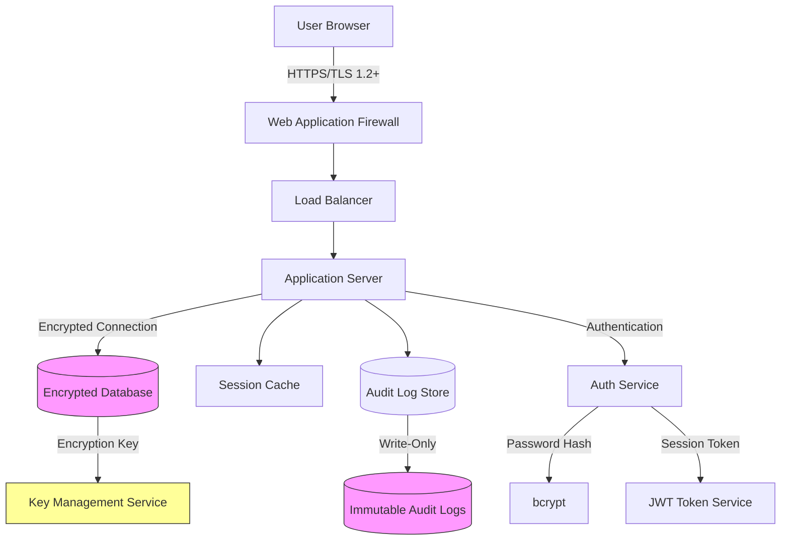

# Security & Compliance

This document provides comprehensive security specifications and compliance readiness guidelines for the Mental Health Consultation Web App.

---

## Security Architecture Overview



---

## 1. Authentication

### 1.1 User Authentication

**Login Mechanism**:
- **Credential Types**: Username/email + password
- **Password Requirements**:
  - Minimum 12 characters
  - At least one uppercase letter (A-Z)
  - At least one lowercase letter (a-z)
  - At least one digit (0-9)
  - At least one special character (!@#$%^&*()_+-=[]{}|;:,.<>?)
- **Password Storage**: bcrypt with salt, cost factor 12 minimum

**Security Controls**:

| Control | Specification | Purpose |
|---------|---------------|---------|
| **Account Lockout** | 5 failed attempts = 30-minute lockout | Prevent brute force attacks |
| **Session Timeout** | 30 minutes of inactivity | Limit exposure on unattended devices |
| **Password Expiry** | 90 days (configurable) | Force periodic updates |
| **Password History** | Cannot reuse last 5 passwords | Prevent password cycling |
| **Temporary Passwords** | Force change on first login | Secure initial access |
| **Session Invalidation** | Logout clears server-side session | Prevent session reuse |

---

### 1.2 Multi-Factor Authentication (MFA)

> [!WARNING]
> **MVP Limitation**: MFA is not included in the MVP but is recommended for production deployment.

**Planned Implementation** (Future Enhancement):
- **TOTP (Time-Based One-Time Password)**: Google Authenticator, Authy compatibility
- **SMS Backup**: Fallback option for users without TOTP device
- **Setup Flow**: Mandatory for admins, optional for clinicians
- **Bypass Codes**: One-time backup codes for device loss

---

### 1.3 Password Reset

**Secure Reset Flow**:
1. User requests password reset (email or username)
2. System generates secure random token (256-bit)
3. Token emailed to user's registered email address
4. Token valid for 24 hours only
5. User clicks link, sets new password (must meet complexity requirements)
6. Token invalidated after use
7. All active sessions terminated

**Security Features**:
- No indication whether email exists in system (prevent user enumeration)
- Rate limiting: Maximum 3 reset requests per hour per IP address
- Token is single-use and time-limited
- Reset action logged in audit trail

---

## 2. Authorization (Access Control)

### 2.1 Role-Based Access Control (RBAC)

**Roles**: Admin, Clinician (see [Roles & Permissions](05-roles-permissions.md) for full matrix)

**Enforcement Levels**:

1. **API Level**: Backend validates role and ownership before executing operations
2. **Database Level**: Row-level security policies filter data by user role
3. **UI Level**: Frontend hides unauthorized features and buttons

**Example Authorization Check** (Pseudo-code):
```python
def can_view_consultation(user, consultation):
    if user.role == 'admin':
        return True
    if consultation.primary_clinician_id == user.user_id:
        return True
    if user.user_id in consultation.collaborator_ids:
        return True
    return False
```

---

### 2.2 Data Ownership Rules

| User Role | Own Data | Collaborative Data | All Data |
|-----------|----------|-------------------|----------|
| **Clinician** | Full CRUD | Read + Update | No access |
| **Admin** | Full CRUD | Full CRUD | Read + Delete |

**Ownership Definition**:
- **Own Data**: Records where user is the creator or primary clinician
- **Collaborative Data**: Consultations where user is added as collaborator
- **All Data**: Any record in the system (admin only)

---

## 3. Data Encryption

### 3.1 Encryption at Rest

**Database Encryption**:
- **Algorithm**: AES-256 (Advanced Encryption Standard)
- **Scope**: Full database encryption (all tables including PHI)
- **Key Management**: External Key Management Service (KMS)
- **Key Rotation**: Automatic rotation every 90 days
- **Backup Encryption**: All database backups encrypted with separate keys

**File Storage Encryption** (if applicable):
- **Documents/Attachments**: AES-256 encryption
- **Encryption at Upload**: Files encrypted before writing to disk
- **Decryption on Download**: Encrypted files decrypted in memory for authorized users

---

### 3.2 Encryption in Transit

**HTTPS/TLS**:
- **Protocol**: TLS 1.2 minimum, TLS 1.3 preferred
- **Certificate**: Valid SSL/TLS certificate from trusted CA
- **Cipher Suites**: Strong ciphers only (AES-GCM, ChaCha20-Poly1305)
- **HSTS**: HTTP Strict Transport Security enabled (max-age=31536000)
- **Certificate Pinning**: (Optional) Mobile app pins server certificate

**API Communication**:
- All API requests require HTTPS
- No fallback to HTTP
- Sensitive data never in URL query parameters (use POST body)

---

### 3.3 Password Hashing

**Algorithm**: bcrypt
- **Cost Factor**: 12 (configurable up to 14 for higher security)
- **Salt**: Unique random salt per password (automatic in bcrypt)
- **Rainbow Table Resistance**: Salting prevents precomputed attacks

**Example** (Pseudo-code):
```python
import bcrypt

# Hashing password
hashed = bcrypt.hashpw(password.encode('utf-8'), bcrypt.gensalt(rounds=12))

# Verifying password
if bcrypt.checkpw(password.encode('utf-8'), stored_hash):
    authenticate_user()
```

---

## 4. Audit Logging

### 4.1 Audit Log Scope

**Logged Events**:

| Event Category | Specific Events | Data Captured |
|----------------|-----------------|---------------|
| **Authentication** | Login success/failure, logout, password change, account lockout | User ID, IP address, user agent, timestamp |
| **Patient Records** | Create, view, update, delete patient | User ID, patient ID, action, changed fields, timestamp |
| **Clinical Data** | Create/update/delete consultation, MSE, diagnosis, review | User ID, record ID, action, changed fields (before/after), timestamp |
| **Data Access** | View patient record, view consultation details | User ID, record ID, timestamp |
| **Reports & Exports** | Generate report, export CSV/PDF | User ID, report type, filters, row count, timestamp |
| **System Admin** | Create/delete user, change role, config change | Admin ID, affected user, change details, timestamp |
| **API Access** | All API calls (optional: verbose mode) | Endpoint, method, user ID, IP, status code, timestamp |

---

### 4.2 Audit Log Structure

**Fields**:
| Field | Type | Description |
|-------|------|-------------|
| `log_id` | UUID | Unique log entry identifier |
| `timestamp` | DateTime (UTC) | When event occurred (microsecond precision) |
| `user_id` | UUID | User who performed action (NULL for system events) |
| `ip_address` | String | Source IP address (IPv4/IPv6) |
| `user_agent` | String | Browser/client identification |
| `event_category` | Enum | High-level category (authentication, patient_records, etc.) |
| `event_type` | String | Specific event (e.g., "login_success", "patient_created") |
| `entity_type` | Enum | Type of affected record (user, patient, consultation, etc.) |
| `entity_id` | String | ID of affected record |
| `action` | Enum | Create, read, update, delete, login, logout, export |
| `changes` | JSON | Before/after values for updates (see below) |
| `status` | Enum | Success, failure, partial |
| `error_message` | Text | Error details if status = failure |
| `hash_chain` | String | SHA-256 hash for tamper detection |

**Changes JSON Format** (for UPDATE operations):
```json
{
  "before": {
    "first_name": "John",
    "phone_number": "555-1234"
  },
  "after": {
    "first_name": "John",
    "phone_number": "555-5678"
  }
}
```

---

### 4.3 Tamper-Evident Logging

**Hash Chain Mechanism**:
- Each log entry includes a hash: `SHA256(log_id + timestamp + previous_hash + user_id + event_type + entity_id)`
- First log entry uses predefined seed hash
- Any tampering breaks the hash chain, making alteration detectable

**Immutability**:
- **Append-Only**: Audit log table does not allow UPDATE or DELETE operations
- **Database Constraints**: Database-level triggers prevent modifications
- **Archive Strategy**: Old logs moved to write-once storage after 1 year

**Verification**:
- Admins can run integrity check to verify hash chain
- Broken chain triggers security alert

---

### 4.4 Audit Log Retention

| Log Type | Retention Period | Archive Strategy |
|----------|------------------|------------------|
| **All Audit Logs** | 7 years minimum (HIPAA) | Move to cold storage after 1 year |
| **Authentication Logs** | 7 years | Same as above |
| **PHI Access Logs** | 7 years | Required for HIPAA compliance |
| **System Logs** | 1 year | Optional archival |

**Compliance Mapping**:
- **HIPAA**: 6-year minimum retention (extended to 7 for safety margin)
- **GDPR**: Logs containing personal data retained per organization's data retention policy
- **State Laws**: Some states require longer retention (e.g., California: 7 years)

---

## 5. Session Management

### 5.1 Session Security

**Session Token**:
- **Format**: JWT (JSON Web Token) or secure random token (256-bit)
- **Storage**: HTTP-only, secure cookie (not accessible to JavaScript)
- **Expiration**: 30 minutes of inactivity
- **Renewal**: Automatically extended on user activity (up to 8 hours max)

**Session Attributes**:
```json
{
  "user_id": "uuid",
  "role": "clinician",
  "created_at": "2025-12-11T23:00:00Z",
  "last_activity": "2025-12-11T23:20:00Z",
  "expires_at": "2025-12-11T23:50:00Z",
  "ip_address": "192.168.1.100"
}
```

**Session Validation**:
- Every API request validates session token
- Check expiration, user_id, role
- Optionally verify IP address (bind session to IP to prevent hijacking)

---

### 5.2 Session Termination

**Automatic Logout**:
- **Inactivity Timeout**: 30 minutes (configurable)
- **Absolute Timeout**: 8 hours maximum (even with activity)
- **Warning**: Display warning 5 minutes before timeout

**Manual Logout**:
- User clicks "Logout" button
- Session token invalidated on server
- Redirect to login page

**Admin Force Logout**:
- Admin can terminate any user's active sessions
- Use case: Immediately revoke access for deactivated user
- All sessions for target user invalidated

---

### 5.3 Concurrent Session Limits

**Max Sessions**: 3 concurrent sessions per user (configurable)

**Rationale**: Allow multi-device use (desktop + tablet + phone) but prevent excessive sharing

**Enforcement**:
- When 4th session created, oldest session automatically terminated
- User sees notification: "Your session on [device] was logged out due to new login on [device]"

---

## 6. Input Validation & Sanitization

### 6.1 Backend Validation

**All User Inputs Validated For**:
- **Type**: String, integer, date, etc. match expected type
- **Length**: Max length enforced (prevent buffer overflow)
- **Format**: Email, phone, postal code, ICD-10 code match expected patterns
- **Range**: Numeric values within valid ranges (e.g., age 0-120)
- **Allowed Characters**: Alphanumeric + specific special chars (prevent injection)

**Example Validation Rules**:
| Field | Validation |
|-------|------------|
| `first_name` | Max 50 chars, letters + spaces + hyphens only |
| `email` | Valid email format (RFC 5322), max 100 chars |
| `patient_id` | Valid UUID format |
| `icd10_code` | Matches ICD-10 pattern (e.g., F32.1) |
| `bp_systolic` | Integer between 50-250 |

---

### 6.2 SQL Injection Prevention

**Prepared Statements / Parameterized Queries**:
- All database queries use parameterized queries
- **Never** concatenate user input into SQL strings

**Example** (Pseudo-code):
```sql
-- UNSAFE (vulnerable to SQL injection)
query = "SELECT * FROM patients WHERE last_name = '" + user_input + "'"

-- SAFE (parameterized query)
query = "SELECT * FROM patients WHERE last_name = ?"
execute(query, [user_input])
```

**ORM Usage**: If using ORM (e.g., SQLAlchemy, Django ORM), leverage built-in parameterization.

---

### 6.3 XSS (Cross-Site Scripting) Prevention

**Output Encoding**:
- All user-generated content encoded before display in HTML
- **Context-Aware Encoding**: HTML encoding for HTML context, JavaScript encoding for JS context, URL encoding for URLs

**Content Security Policy (CSP)**:
- HTTP header restricts script sources
- Example: `Content-Security-Policy: default-src 'self'; script-src 'self' https://trusted-cdn.com`

**Sanitization**:
- Rich text fields (e.g., clinical notes) sanitized to allow safe HTML only (e.g., `<b>`, `<i>`, `<ul>`, `<li>`)
- Strip dangerous tags (`<script>`, `<iframe>`, `<object>`)

---

### 6.4 CSRF (Cross-Site Request Forgery) Prevention

**CSRF Tokens**:
- Every state-changing request (POST, PUT, DELETE) includes CSRF token
- Token validated on server before processing request
- Token tied to user session (prevents replay attacks)

**SameSite Cookie Attribute**:
- Session cookies set with `SameSite=Strict` or `SameSite=Lax`
- Prevents CSRF by blocking cross-site cookie sending

---

## 7. Vulnerability Management

### 7.1 Security Updates

**Dependency Management**:
- Regular updates to application framework and libraries
- Automated vulnerability scanning (e.g., Dependabot, Snyk)
- Patch critical vulnerabilities within 7 days of disclosure

**Security Patching Schedule**:
| Severity | Response Time |
|----------|---------------|
| **Critical** | 7 days |
| **High** | 30 days |
| **Medium** | 90 days |
| **Low** | Next scheduled release |

---

### 7.2 Penetration Testing

**Frequency**: Annual penetration testing by third-party security firm

**Scope**:
- Web application security (OWASP Top 10)
- API security
- Authentication and authorization
- Data encryption validation
- Session management

**Remediation**: All high and critical findings addressed within 30 days

---

### 7.3 Web Application Firewall (WAF)

**Purpose**: Protect against common web attacks

**Protected Against**:
- SQL injection
- Cross-site scripting (XSS)
- Cross-site request forgery (CSRF)
- DDoS attacks
- Malicious bots

**Deployment**: Cloud WAF (e.g., AWS WAF, Cloudflare) or on-premise appliance

---

## 8. HIPAA Compliance

### 8.1 HIPAA Security Rule Requirements

**Administrative Safeguards**:

| Requirement | Implementation |
|-------------|----------------|
| **Security Management Process** | Risk assessments, sanction policies, incident response plan |
| **Assigned Security Responsibility** | Designated security officer |
| **Workforce Security** | User authorization process, role-based access |
| **Information Access Management** | Role-based permissions (see [Roles & Permissions](05-roles-permissions.md)) |
| **Security Awareness Training** | Annual HIPAA training for all users |
| **Security Incident Procedures** | Incident response plan, audit log monitoring |

**Physical Safeguards**:

| Requirement | Implementation |
|-------------|----------------|
| **Facility Access Controls** | Datacenter physical security, badge access |
| **Workstation Security** | Screen timeout policies, device encryption |
| **Device & Media Controls** | Secure disposal of decommissioned hardware |

**Technical Safeguards**:

| Requirement | Implementation |
|-------------|----------------|
| **Access Control** | Unique user IDs, automatic logoff, encryption |
| **Audit Controls** | Comprehensive audit logging (see Section 4) |
| **Integrity Controls** | Hash chain in audit logs, data validation |
| **Transmission Security** | TLS 1.2+ encryption for all data in transit |

---

### 8.2 HIPAA Privacy Rule

**Minimum Necessary Principle**:
- Clinicians see only patients they treat (own + collaborative)
- Admins have read access to all data for oversight but limited by need-to-know

**Patient Rights**:
- **Access**: Patients can request copies of their records (handled offline in MVP)
- **Amendment**: Patients can request corrections (handled via clinician in MVP)
- **Accounting of Disclosures**: Audit logs track all PHI access and exports

**Notice of Privacy Practices**:
- Organization must provide patients with privacy notice (handled outside application)

---

### 8.3 HIPAA Breach Notification

**Breach Detection**:
- Audit log monitoring for suspicious access patterns
- Alerts for mass data exports
- Unauthorized access attempts logged and investigated

**Breach Response** (If PHI compromised):
1. **Immediate**: Contain breach, revoke unauthorized access
2. **Within 60 days**: Notify affected individuals
3. **Document**: Breach investigation and response in audit trail
4. **Report**: Notify HHS if breach affects 500+ individuals

> [!CAUTION]
> **Breach Notification Requirement**: Organizations using this application must have a documented breach notification policy and incident response plan to comply with HIPAA.

---

## 9. GDPR Compliance (If Applicable)

### 9.1 GDPR Principles

| Principle | Implementation |
|-----------|----------------|
| **Lawfulness, Fairness, Transparency** | Consent documentation, privacy notices |
| **Purpose Limitation** | Data collected only for clinical care purposes |
| **Data Minimization** | Only essential clinical data collected |
| **Accuracy** | Update capabilities for patient demographics |
| **Storage Limitation** | Configurable retention policies |
| **Integrity and Confidentiality** | Encryption, access controls, audit logs |
| **Accountability** | Audit logs, admin oversight, compliance documentation |

---

### 9.2 Data Subject Rights

**Right to Access** (Article 15):
- Patients can request copies of their data
- Patient details report provides export capability

**Right to Rectification** (Article 16):
- Patients can request corrections to inaccurate data
- Clinicians can update patient demographics

**Right to Erasure** (Article 17):
- "Right to be Forgotten" in limited circumstances
- Admin can hard-delete patient records (with dual approval and audit)

**Right to Data Portability** (Article 20):
- Patients can request data in machine-readable format
- CSV export provides portability

**Right to Object** (Article 21):
- Patients can object to certain processing
- Handled via offline consent management (MVP limitation)

---

### 9.3 Data Protection by Design

**Privacy Controls**:
- Role-based access minimizes data exposure
- Audit logs track all data access
- Encryption protects data at rest and in transit
- Data retention policies limit storage duration

**Data Processing Agreement (DPA)**:
- If hosted by third-party provider, DPA required
- DPA specifies processor obligations, data security, breach notification

---

## 10. Backup & Disaster Recovery

### 10.1 Backup Strategy

**Backup Schedule**:
| Backup Type | Frequency | Retention |
|-------------|-----------|-----------|
| **Full Backup** | Daily (2:00 AM) | 30 days |
| **Incremental Backup** | Every 4 hours | 7 days |
| **Transaction Log Backup** | Every 15 minutes | 7 days (for point-in-time recovery) |

**Backup Storage**:
- **Primary**: On-site storage (same datacenter, separate hardware)
- **Secondary**: Off-site storage (geographically separate location)
- **Encryption**: All backups encrypted with AES-256

**Backup Testing**:
- Monthly restore test to verify backup integrity
- Annual full disaster recovery drill

---

### 10.2 Disaster Recovery

**Recovery Objectives**:
- **RTO (Recovery Time Objective)**: 4 hours (application restored within 4 hours of disaster)
- **RPO (Recovery Point Objective)**: 15 minutes (maximum data loss: 15 minutes)

**Disaster Recovery Plan**:
1. **Disaster Declaration**: Determine if disaster recovery needed
2. **Failover**: Switch to backup datacenter or restore from backup
3. **Data Restoration**: Restore database from most recent backup
4. **Validation**: Verify data integrity and application functionality
5. **Communication**: Notify users of system status
6. **Post-Mortem**: Document incident and lessons learned

**High Availability** (Future Enhancement):
- Active-passive or active-active database replication
- Load-balanced application servers
- Near-zero downtime for maintenance

---

## 11. Security Best Practices

### 11.1 Development Security

**Secure Coding Practices**:
- Follow OWASP Secure Coding Practices
- Code reviews for security vulnerabilities
- Static analysis tools (SAST) in CI/CD pipeline
- Dependency vulnerability scanning

**Secrets Management**:
- No hardcoded passwords, API keys, or encryption keys in code
- Environment variables or secrets management service (e.g., AWS Secrets Manager, HashiCorp Vault)
- Encryption keys stored in external KMS

---

### 11.2 Infrastructure Security

**Network Security**:
- Firewall rules: Allow only necessary ports (HTTPS 443, SSH 22 from bastion only)
- Private subnets for database servers (no direct internet access)
- Bastion host for administrative access

**Operating System Hardening**:
- Minimal OS installation (remove unnecessary services)
- Regular security patches
- Anti-malware software (if applicable)

**Database Security**:
- Strong database passwords (separate from application passwords)
- Database user permissions: Application uses limited-privilege user (not root/admin)
- Database firewall: Allow connections only from application servers

---

### 11.3 Monitoring & Alerting

**Security Monitoring**:
- **Failed Login Attempts**: Alert if 10+ failures from single IP in 10 minutes
- **Mass Data Export**: Alert if user exports >1000 records in single session
- **Unauthorized Access Attempts**: Alert on 403 Forbidden responses
- **Privilege Escalation**: Alert on role changes

**Log Aggregation**:
- Centralized logging (e.g., ELK stack, Splunk)
- Real-time analysis for security events
- Retention: 1 year for security logs

**Alerting Channels**:
- Email to security team
- SMS/pager for critical alerts
- Integration with incident management system

---

## 12. Compliance Checklist

### Pre-Deployment Security Checklist

- [ ] TLS 1.2+ enabled with strong ciphers
- [ ] Database encryption enabled (AES-256)
- [ ] Password policy enforced (12+ chars, complexity)
- [ ] Session timeout configured (30 minutes)
- [ ] Account lockout enabled (5 attempts)
- [ ] Audit logging enabled for all PHI access
- [ ] Backup schedule configured and tested
- [ ] Disaster recovery plan documented
- [ ] CSRF protection enabled
- [ ] XSS prevention (output encoding)
- [ ] SQL injection prevention (parameterized queries)
- [ ] Web Application Firewall (WAF) deployed
- [ ] Security headers configured (CSP, HSTS, X-Frame-Options)
- [ ] Vulnerability scanning scheduled
- [ ] Penetration testing completed
- [ ] HIPAA training completed for all users
- [ ] Business Associate Agreement (BAA) signed (if cloud-hosted)

---

**Next Steps**: Review [MVP Boundaries](08-mvp-boundaries.md) for scope limitations and future enhancements.
